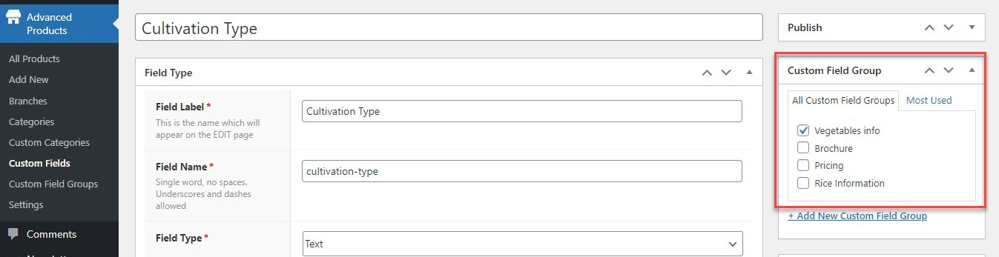

# Custom Fields

Custom fields are a handy feature that allows you to add extra data and information to advanced products.

## Add a new custom field

To create new custom fields, you should go to WP-admin > Advanced Products > Custom Fields > Add New.

All fields must have a **“Field Label”** and **“Field Name.”**

* **Field Label:** Visible when entering content but is not used by the API. Use capitals and spaces for human-friendly field text.
* **Field Name:** This is autogenerated from the field label. Used in the API and templates to retrieve content and data. This should be lower case, and have no spaces or special characters.

## Many field types

You can choose between 25 different input types to add to custom fields, including text boxes, number fields, dropdown lists, checkboxes, radio buttons, image swatches, color swatches, date fields, and file upload.

* **Text** – A normal text input field to collect single-line text
* **Text area** – To collect multi-line text
* **Email** – An input field to accept only email addresses
* **Password** - A single-line text field whose value is obscured. Will alert user if site is not secure.
* **URL** – A text field to accept only links (URLs)
* **Number** – A number field to accept both decimal or whole numbers
* **Select (drop-down)** – A dropdown field to select one option from a list of options
* **Checkboxes** – To choose one or more options
* **Radio buttons** – To select one option from multiple options
* **True/false** – A single “yes or no” checkbox, which you usually know from “accept the terms of conditions” fields
* **Paragraph** – If you want to add static blocks of text in between input fields, this does the trick!

## Custom field groups assignment

Besides protected custom fields (Video, Gallery, Category, Branch, and Price), all new custom fields created should be assigned to specific field groups. 

## Configure field display

By configuring the field display options, you can decide whether the custom field is shown in the listing view and search view or not.

