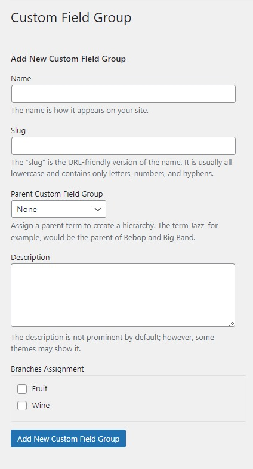

# Custom Field Groups

Advanced Products uses field groups to attach fields to each product.

* Please go to **WP-admin > Advanced Products > Custom Field Group**
* You will see a form on the left to create a new Field Group. Enter the name of the field group and other info.
* Associated Branch: Select one or more branches that connect with the field groups.

