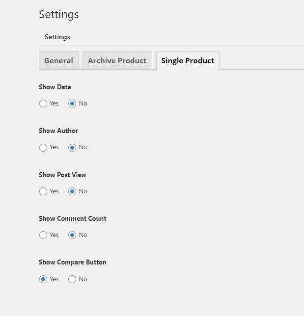

# General Settings

## General Settings

For general settings, you can have options to configure

* Mileage Unit
* Currency symbol
* Symbol Placement
* Thousand Separator
* Decimal separator
* Number of decimals

## Archive Product Page

For archive product page, you can show or hide Compare button, Quickview button

Choose an order type that products should be displayed according to:

* Most recent first
* Oldest first
* Title Alphabetical
* Title Reverse Alphabetical
* Author Alphabetical
* Author Reverse Alphabetical
* Most Hits
* Least Hits
* Minimum Price First
* Maximum Price First

## Single Product Page

For single or detailed product pages, you can configure to show or hide Date, Author, Post view, Comment count, and Compare button.

