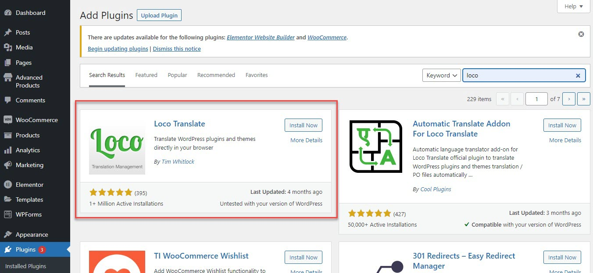
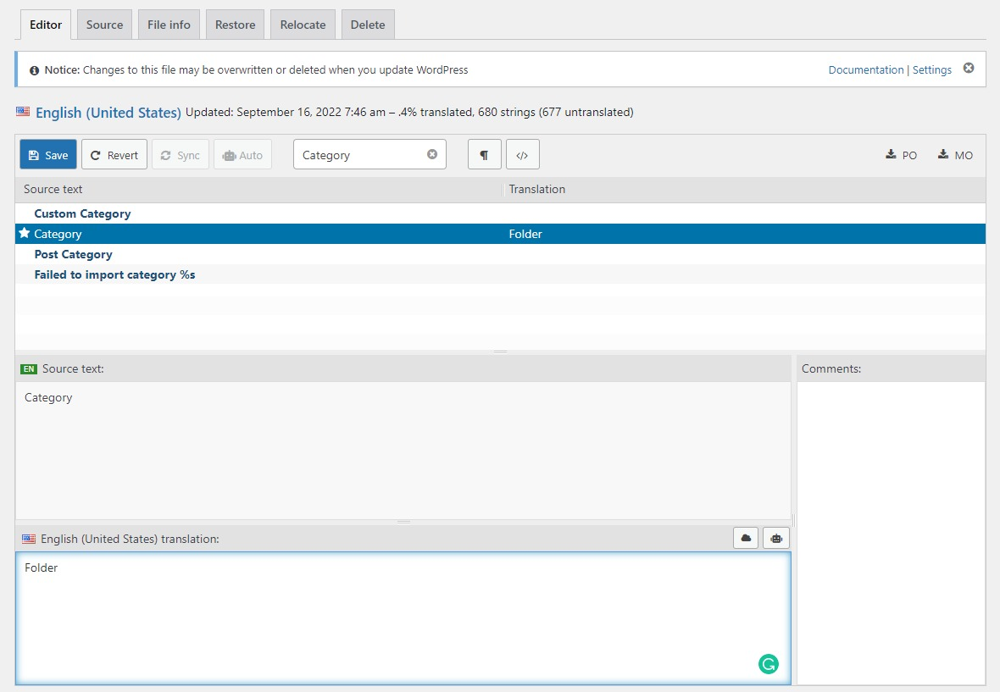

# Plugin Translation

If you wish to translate words of the advanced product plugin (ex: Inventory Search Fields, Custom Fields, Product Categories ...), please install Loco Translate plugin which can support you to translate them.

## Install Loco translate plugin

* Please go to **WP-admin > Plugins > Add new**
* Search Loco translate and click the Install button, then click Activate

## Start translating

* You're supposed to go to Loco Translate plugin > Plugins > Advanced Products
* Install your language by clicking on "Install new language"
* Search your words and replace them with the new ones

