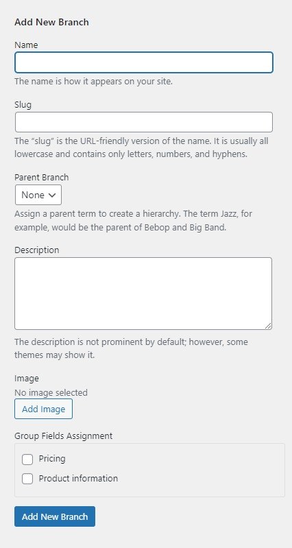

# Product Branch

To create a product branch, please go to **WP-admin > Advanced Products > Branch**

On the left, you will see a form to create a new branch, let's enter the branch name and other info.

Group field assignment: you should assign the branch to one or more custom group fields that is (are) created in the Custom Group Field section.

