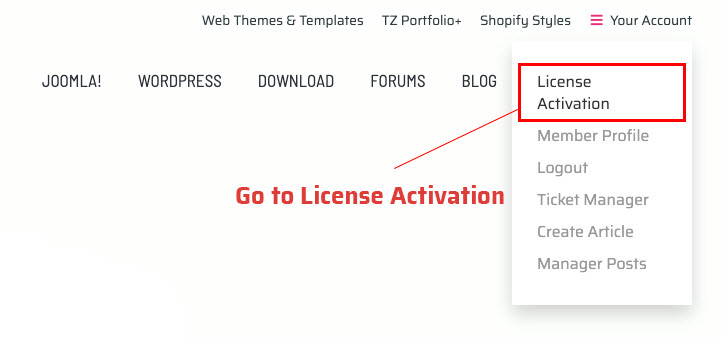
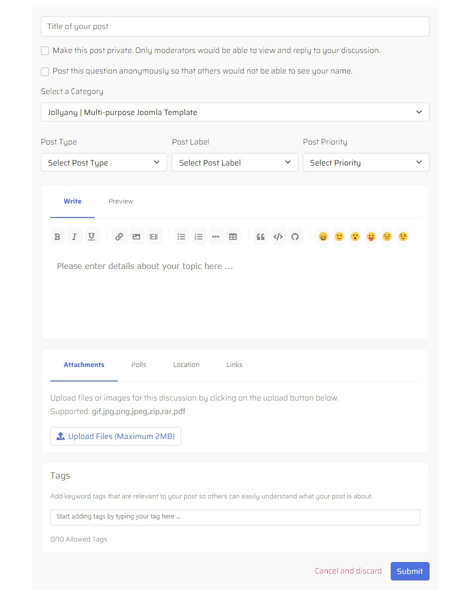

# How to submit a support ticket

Sometimes customers are confused about the way to get assistance about technical issues or ask a question relating to the product. This article is written to provide you with detailed instructions on how to [submit a ticket on TemPlaza’s forum](https://www.templaza.com/forums.html). The forum is a private ticket system, there is no need to worry about the information posted on your ticket.

Please follow these steps below:

* Login / Register a user account
* Verify your Envato license
* Submit a support ticket

## Step 1: Login / Register a user account

If you have already had a user account, please go to TemPlaza website, click on “Login / Register and log in to your account. In case, you haven’t had an account yet, please click on “Create an account”. Then you will be redirected to the [Create An Account page](https://www.templaza.com/create-an-account.html).

To register a new account, you’re supposed to add a unique username, a strong password, and a valid email address, and confirm them, then click on Register. The system will send you a validation email to your email address to activate the account.

## Step 2: Verify your Envato license

After logging into your account on our website:

* Please go to the [License Activation page](https://www.templaza.com/license-activation.html)
* Select the product you need to verify (the product you purchased, ex: Jollyany | Multi-Purpose Joomla Template).
* Click on **“Verify Purchase With Envato”**
* A popup of the Envato login form will appear and start to log in to your Envato account
* The system will locate your purchase and save your license

You’ll need to verify your Envato License first, which will grant you access to submit a ticket. When the license is already shown out, please click on the **“Proceed“** button to continue.

Your license info will be displayed below:

> You just need to verify the Envato license in the first login only. For the next ticket, please log in to your account and start to post your question.

## Step 3: Ask a question / submit a support ticket

When your purchase has already been verified, you’re entitled to create a ticket or a post on our forum. Please click on “Ask A Question” or “Write A Post”, fulfill the ticket form and click the “Submit” button.

* **Title of your post:** Enter the subject of your ticket
* **Select a category:** This field will show the name of the product you purchased on Envato Market.
* **Post type:** Select a post type (Bug, Issue, or Task).
* **Post label:** On Hold, Accepted, Working On, or Rejected.
* **Post Priority:** Set the post priority (Low, Normal, or Critical) which depends on the severity level of your questions

Once submitted, the ticket is added to our support queue. Our technical staff will handle and update it as soon as possible. If you have any problem with submitting tickets, feel free to let us know via Live Chat or send emails to support@templaza.com.

