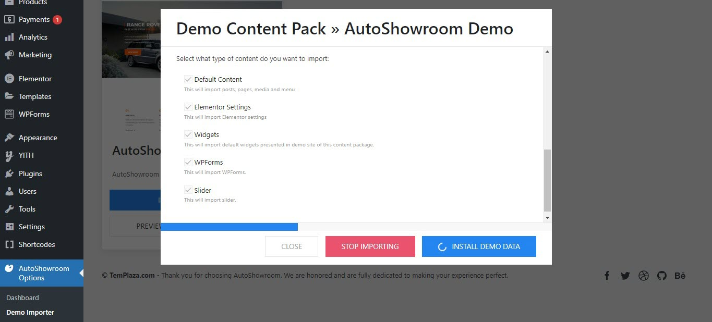

# Import multiple themes

If you buy Auto Showroom license, you'll have a chance to install other premium themes included in the package, such as Autobike, Amanus, Plazart.

## Install a sub-theme

## Import the demo with 1-click Installer

### Install required plugins

When you click on "Install Demo Data", a popup will appear and show you a list of required plugins. You should install and activate them first.

**Install required plugins**

After all the required plugins are installed and activated, you should choose all the content types and click on "Install Demo Data" to start importing.

The import is on the progress. You should wait until it's completed.

## Import Data Package Manually

Here below is an instruction on how to import the demo content with XML file that is included in each theme package.

- Go to wp-admin -> Tools -> Import -> WordPress (Run Importer)
- Choose import file and click “Upload file and import”

Upload the xml file from the package

