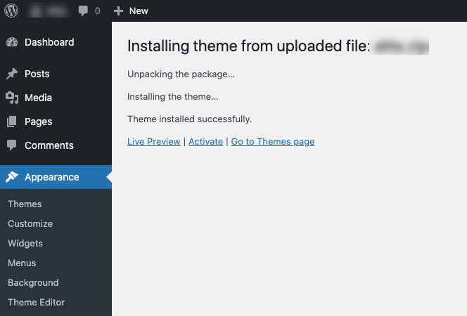

# Theme Installation
## 1. Download the theme package
Go to Themeforest.net > Your Download page. Please download the package from your [download page](https://themeforest.net/downloads).

## 2. Installing your theme
To install the theme correctly, after downloading the theme package from Themeforest, you need to **Unzip the package**. There are folders inside.

## 3. Install Theme via WordPress Admin
- Navigate to Appearances -> Themes
- Click **Add New** button and then hit the **Upload Theme** button
- Click on Browser to upload the **theme's.zip** file (ex: alita.zip) in the Theme folder and click **Install Now**.
- Click **Activate** to activate the installed themes.

## 4. Install the theme via FTP
- Unzip the theme's **.zip** in the **theme folder** of the theme package.
- Upload the extracted folder in the previous step into **/wp-content / themes/**
- To activate the theme, go to **Appearances --> Themes>** and activate it.

