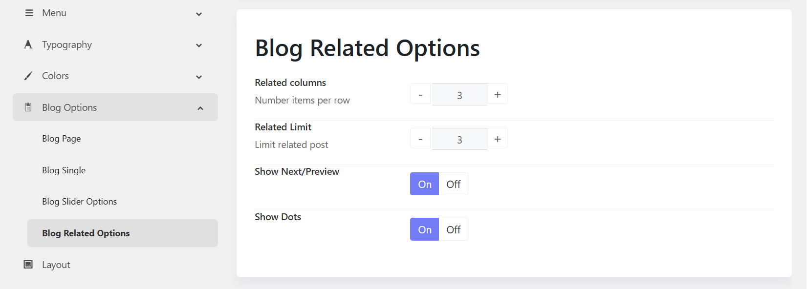

# Blog Related Options

The **Blog Related** settings allow you to control how related posts are displayed on a blog article page. These options help improve content discovery and encourage visitors to explore more articles.

## 1. Related Columns

**Purpose:** Defines the number of related posts displayed in each row.

* **2 Columns** – Displays 2 related posts per row.
* **3 Columns** – Displays 3 related posts per row.
* **4 Columns** – Displays 4 related posts per row.

**When to use:**

* Use fewer columns for larger post thumbnails and titles.
* Use more columns to display more content at once.

## 2. Related Limit

**Purpose:** Controls the total number of related posts displayed.

**Example:**

* **3** – Displays up to 3 related posts.
* **6** – Displays up to 6 related posts.

## 3. Show Next/Previous

**Purpose:** Displays navigation arrows for the related post slider.

* **On** – Shows Previous and Next arrows.
* **Off** – Hides navigation arrows.

**When to use:**

* Enable when displaying multiple related posts in a carousel.
* Disable for a simpler, cleaner appearance.

## 4. Show Dots

**Purpose:** Displays pagination dots below the related post slider.

* **On** – Shows navigation dots indicating the number of slides.
* **Off** – Hides the pagination dots.

**When to use:**

* Enable to help visitors understand how many slides are available.
* Disable when using arrow navigation only or when displaying a small number of related posts.

