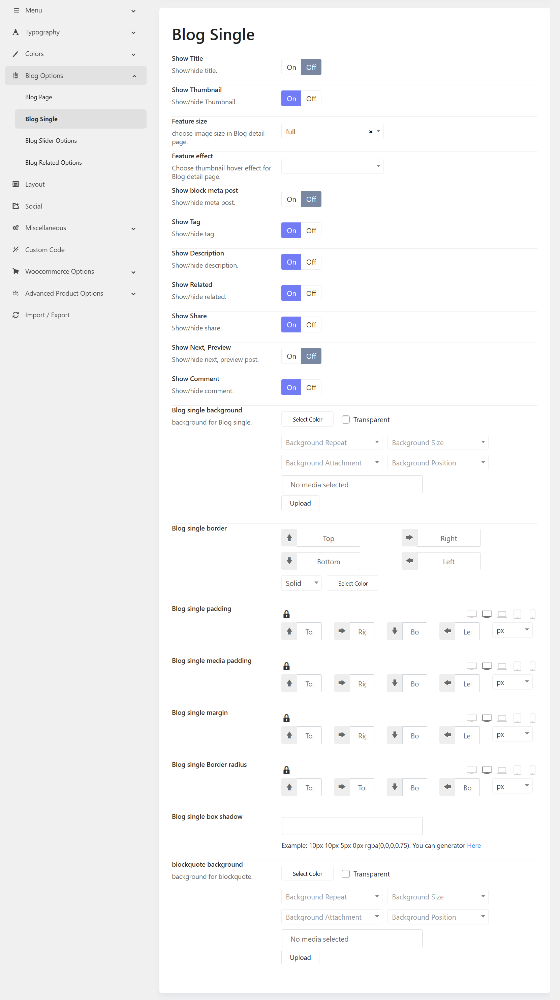

# Blog Single Options

The **Blog Single** settings allow you to control the layout, visibility, and styling of individual blog post pages. These options help ensure consistency in presentation while giving flexibility to match your website’s design.

## 1. Display Settings

These options control the visibility of key elements within a single blog post.

* **Show Title**
  Enable or disable the display of the post title.

* **Show Thumbnail**
  Show or hide the featured image associated with the post.

* **Feature Size**
  Select the size of the featured image (e.g., full, medium, thumbnail).

* **Feature Effect**
  Apply a hover effect to the featured image for enhanced visual interaction.
  
## 2. Post Information

Manage the visibility of post metadata and descriptive content.

* **Show Block Meta Post**
  Display post metadata such as author name, publish date, and category.

* **Show Tag**
  Enable or disable the display of post tags.

* **Show Description**
  Show or hide the post excerpt or summary.

## 3. Navigation & Interaction

Enhance user engagement and navigation between posts.

* **Show Related**
  Display a list of related posts based on category or tags.

* **Show Share**
  Enable social media sharing buttons for the post.

* **Show Next, Preview**
  Show navigation links to the next and previous posts.

* **Show Comment**
  Enable or disable the comment section for user interaction.

## 4. Styling Options

Customize the visual appearance of the blog single page.

### Background

* **Blog Single Background**
  Set a background color or upload a background image.
  Additional controls include:

    * Background Repeat
    * Background Size
    * Background Attachment
    * Background Position

### Border

* **Blog Single Border**
  Configure border width for each side (top, right, bottom, left), select border style, and define border color.

### Spacing

* **Blog Single Padding**
  Adjust the inner spacing within the blog container.

* **Blog Single Media Padding**
  Control spacing around images and media elements.

* **Blog Single Margin**
  Define the outer spacing around the blog container.

### Border Radius

* **Blog Single Border Radius**
  Set the roundness of the container corners.

### Box Shadow

* **Blog Single Box Shadow**
  Apply shadow effects to create depth and visual hierarchy.

## 5. Blockquote Styling

* **Blockquote Background**
  Customize the background color or image for blockquote elements within the post content.

