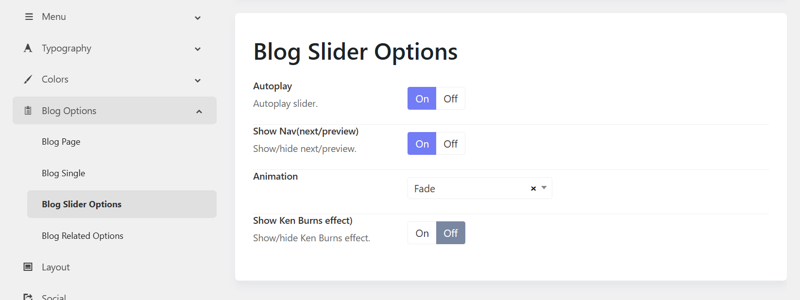

# Blog Slider Options

The **Blog Slider Options** allow you to control how blog posts are displayed and animated within the slider. These settings help create a more engaging browsing experience for your website visitors.

## 1. Autoplay

**Purpose:** Automatically rotates through blog slides without user interaction.

**Options:**

* **On** – Slides advance automatically after a set interval.
* **Off** – Visitors must manually navigate between slides.

**When to use:**

* Enable for featured content, news highlights, or homepage sliders.
* Disable when users need more time to read slide content.

## 2. Show Nav (Next/Previous)

**Purpose:** Displays navigation arrows that allow visitors to move between slides manually.

**Options:**

* **On** – Shows Previous and Next navigation controls. Enable for better user control and accessibility.
* **Off** – Hides navigation arrows. Disable if you're interested in a cleaner or minimal design.

## 3. Animation

**Purpose:** Defines the transition effect used when switching between slides.
You can choose one of animation options available.

## 4. Show Ken Burns Effect

**Purpose:** Applies a subtle zoom and pan animation to slider images, creating a cinematic effect.

* **On** – Enables the Ken Burns animation.
* **Off** – Displays images without zooming or panning.

**When to use:**

* Enable when using high-quality featured images to add visual interest.
* Disable if you prefer static images or want to minimize motion effects.

