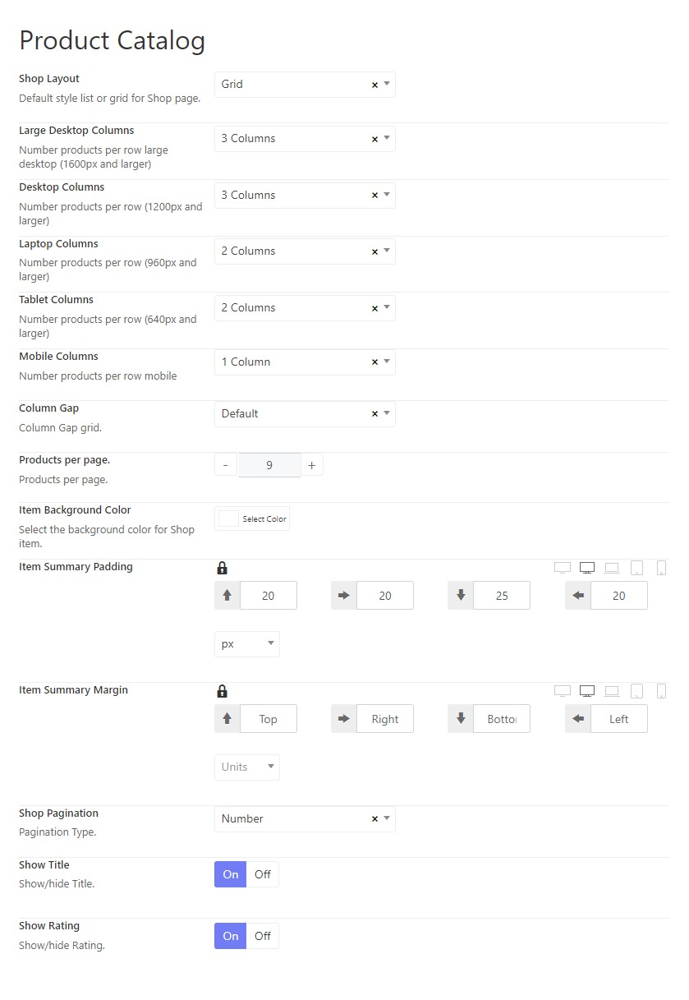
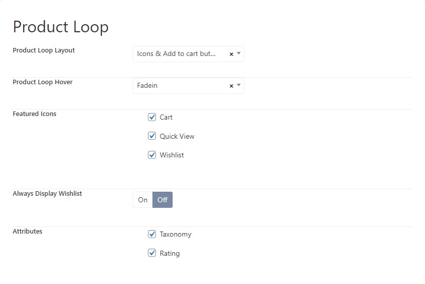
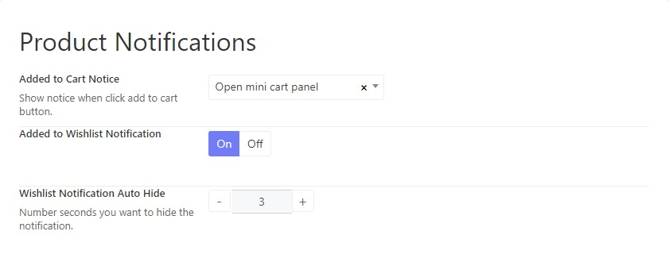
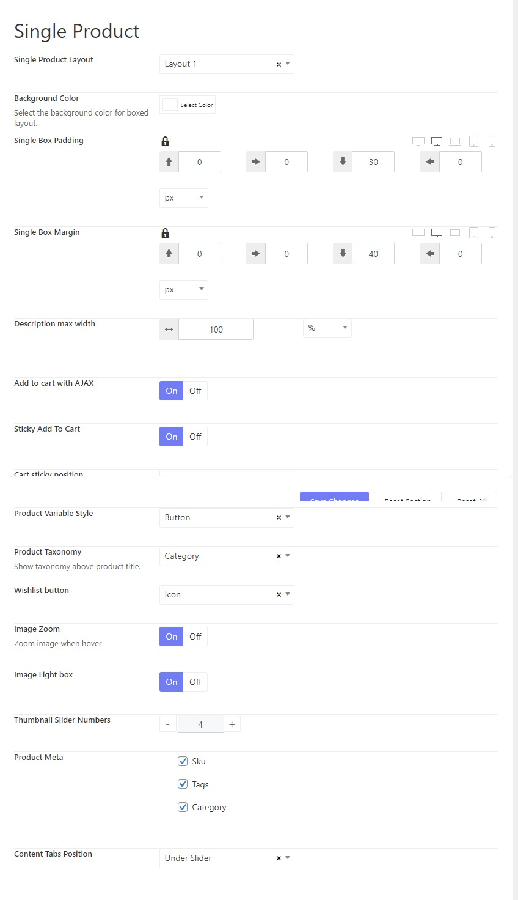
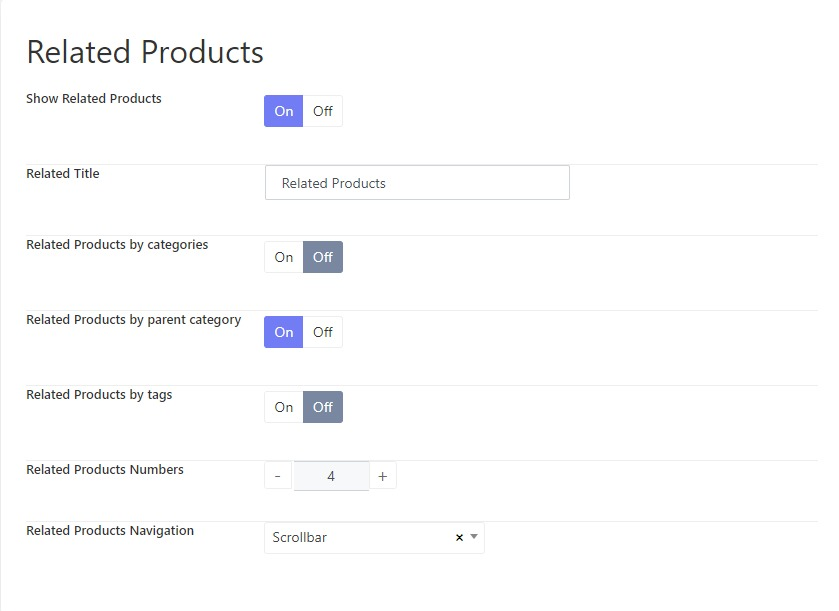
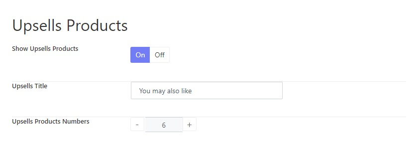
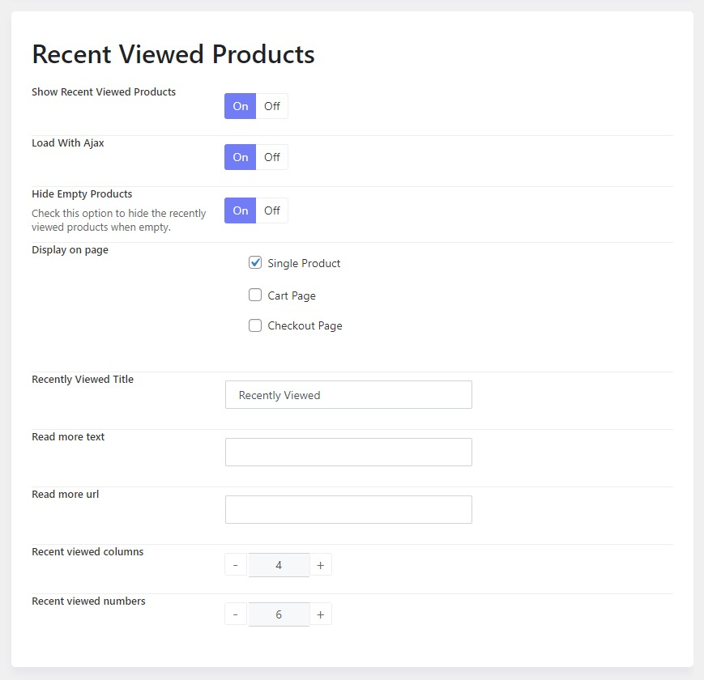

# Woocommerce Options

This section contains multiple options for Woocommerce product page. You can find helpful options to configure the product listing, related products, single product, product cart, mini cart and so on.

## 1.Product Catalog

**Shop layout:** choose a grid or masonry layout to display your products on the shop page.

If you choose the grid layout, you'll see below options: 

* Large Desktop Columns: Set the number of product columns per row on large desktops.
* Desktop Columns: Set the number of product columns per row on desktops.
* Laptop Columns: Set the number of product columns per row on laptops.
* Tablet Columns: Set the number of product columns per row on tablets.
* Mobile Columns: Set the number of product columns per row on mobile phones.
* Column Gap: Set the gap between columns in the grid layout.
* Products per page: Set the number of products per page.
* Item Background Color: Choose a background color for the product item.
* Item Summary Padding:
* Item Summary Margin:
* Shop Pagination: There are 3 types of paginations you can choose: Number, Button Load More and Infinite Scroll.
* Show title: Disable the option if you don't want to show the product's title.
* Show Rating: Disable the option if you're not interested in displaying the product's rating.

## 2.Product Loop

* **Product Loop Layout:** there are some available layouts for product loop that you can choose from including Icon & add to cart button, Icon over thumbnail on hover,  icons & quick view button, icons on bottom, simple, standard button, info on hover, icons & add to cart text, and quick shop button.
* **Product Loop Hover:** Choose a hover effect when hovering on a product thumbnail
* **Featured Icons:** Select among Cart, Quick View, and Wishlist icons to display on a product's thumbnail.
* **Always Display Wishlist:** Disable the option if you don't want to display the wishlist.
* **Attributes:** Choose product attributes to display on the shop page

## 3.Product Notification

* **Added to Cart Notice:** Choose one of the notice styles after adding a product to the cart.
* **Added to Wishlist Notification:** Enable the option if you receive a notification after a product is added to the wishlist.
* **Wishlist Notification Auto Hide:** Set the number of seconds that wishlist notification should remain.

## 4.Single Product

- **Single product layout**: Choose a single product layout that you're interested in.
- **Background color**: Set the background color of the single product page.
- **Single box padding**: Set the padding (top, right, bottom, and left) of the single product content.
- **Single box margin**: Adjust the margin (top, right, bottom, and left) of the single product content.
- **Description max-width**: Set the max-width of the product description in units: percentage, pixel, or em.
- **Add to cart with AJAX**: Enable the option to add product to cart using AJAX.
- **Sticky add-to-cart**: Enable the option if you want the Add-to-cart to be sticky.
- **Cart sticky position**: Choose a position for the sticky add-to-cart.
- **Product Variable Style**: Choose a style for the product variables.
- **Product Taxonomy**: Choose a type of product taxonomy that appears on the product title.
- **Wishlist Button**: Choose a type of wishlist button.
- **Image Zoom**: Enable the option if you want the product image to be zoomable.
- **Image Lightbox**: Enable the option if you'd like to open the product image with lightbox.
- **Thumbnail Slider Numbers**: Set the number of thumbnail sliders.
- **Product Meta**: Select the product's meta displayed on the single product page.
- **Content Tabs Position**: Choose a position on which the product's content tabs should be displayed.

## 5.Related Products

Related Products is a section on some templates that pulls products from your store that share the same tags or categories as the current product.

These products cannot be specified in the admin but can be influenced by grouping similar products in the same category or by using the same tags.

**Related products are usually shown on the detailed product page.**

## 6.Upsell Products

Up-sells are products that you recommend instead of the currently viewed product.

They are typically products that are more profitable or better quality or more expensive. Depending on your theme template, these products are displayed on the single product page underneath the product’s description.

**Up-sells (user-defined) show on the product page.**

## 7.Recently Viewed Products

**Recently Viewed Products for WooCommerce** displays the products recently viewed by Members and Guests on a separate page.

## 8.Product Badges

Product badges are used to add badges to products to highlight key features, special offers and more. Product badges can enhance customer understanding of key product features, highlight promotions and products with time-limited offers, improve click-through rates and many more sales-boosting benefits.

