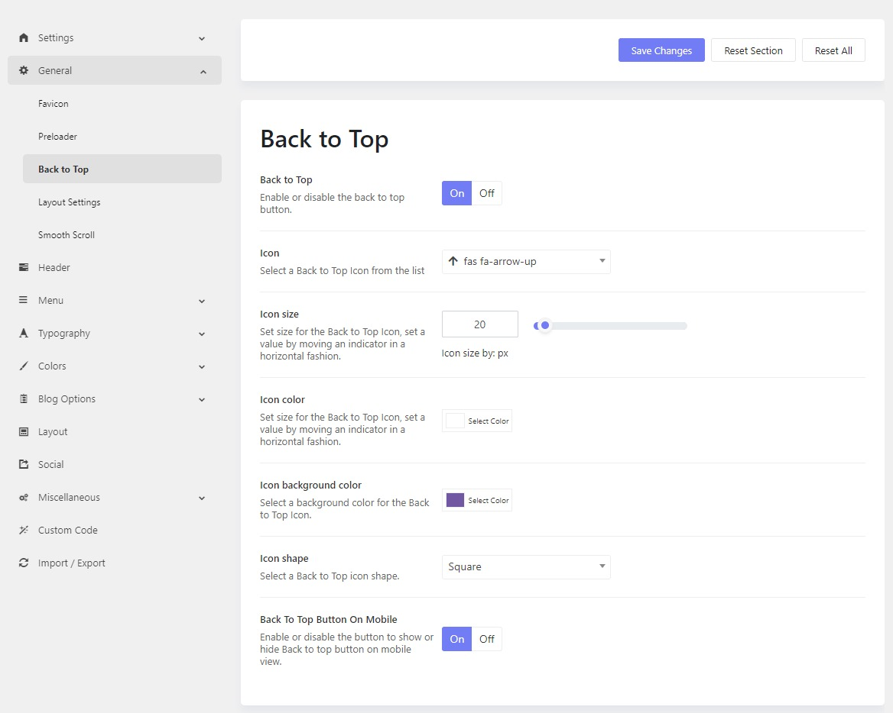

# Back To Top

The Back to top button will instantly redirect the user to the top of the page with just a click. It is displayed at the bottom right corner of the page as the user scrolls down, also you can easily disable this option if you don’t need it.

* Please go to **Admin > Theme Options > Settings > General > Back To Top**
* You can enable or disable the button, select a back-to-top icon, icon size, icon color, icon background color, and icon shape, and choose if you want to enable or disable the icon on mobile devices.

