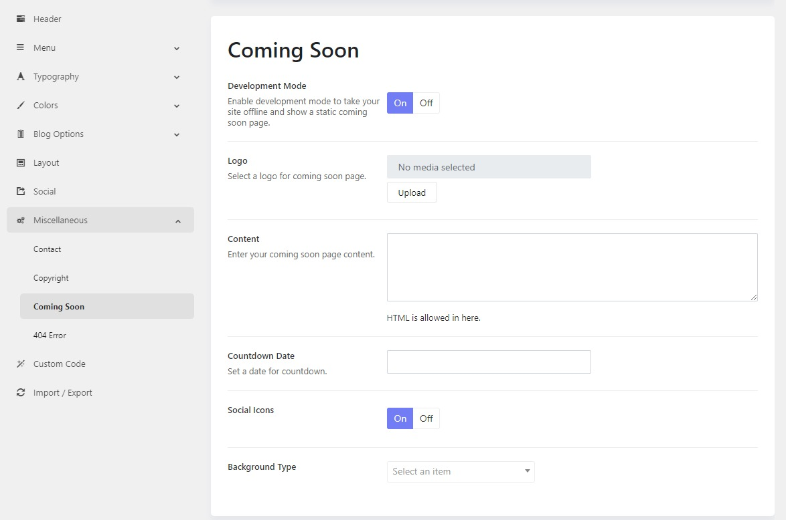

# Coming Soon

When your website is under construction or maintenance, you’ll surely in the need of showing the maintenance mode. With TemPlaza framework, you can easily customize the maintenance mode page of your website.

* Please go to Admin > Theme Options > Settings > Miscellaneous > Coming Soon
* Enable or disable Development Mode
* **Logo:** Select a logo that will display on the coming soon page, the default template logo is displayed if not selected.
* **Content:** Enter the description for your website’s coming soon page.
* **Countdown Date:** set a date for the countdown when your site will be going live.
* **Social Icons:** enable/disable whether you want to show the social icons or not. These icons are configured in Social Section.
* **Background Type:** none / color / image / video.

