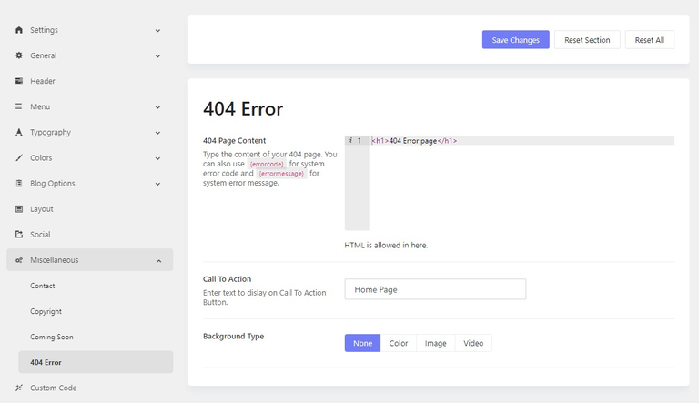

# 404 Error Page

TemPlaza framework allows you to customize the 404 error page for your website just with ease.

* Please go to **Admin > Theme Options > Settings > Miscellaneous > 404 Error**
* **404 Page Content:** Enter the content that will be displayed on the error page. It has to be within the HTML tags.
* **Call To Action:** This button will be displayed on the error page that will help the user redirect to another working page on the website.
* **Background Type:** you can choose the background of the page from the given options: Color, Image or Video and if you do not want anything to be displayed select None.

