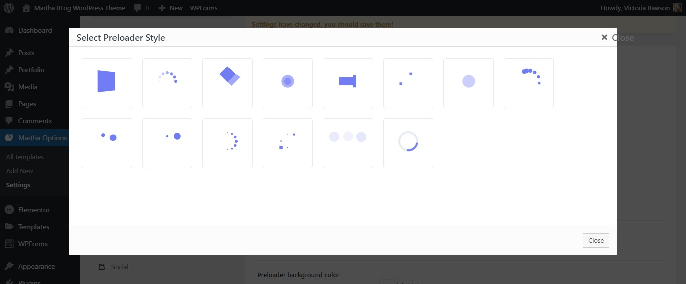
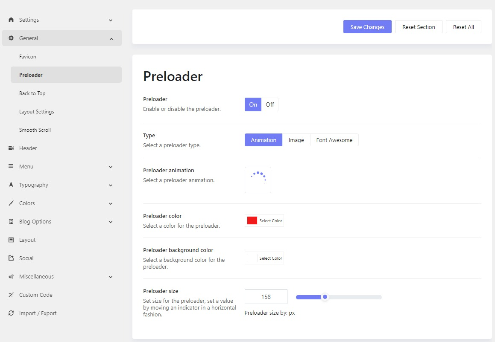

# Preloader

This option allows you to enable or disable the preloader for the site. It is displayed while the content is being loaded.

There are 3 preloader types: Animation, Image, and Font Awesome. Please go to **Admin > Theme Options > Settings > General > Preloader.**

## Preloader: Animation

When you choose animation type, just select a suitable animation available in the list. It also gives you options to adjust the color, background color, and size of the selected animation.

## Preloader: Image

When you select the Image as the preloader type, you can display your logo or any other images, while the page is being loaded.

## Preloader: Fontawesome

You will see a list of font-awesome icons to choose from in the FontAwesome library.

