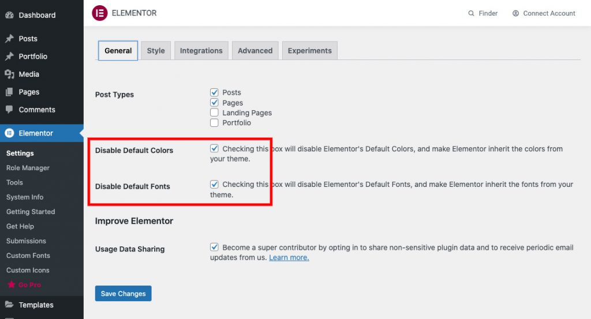
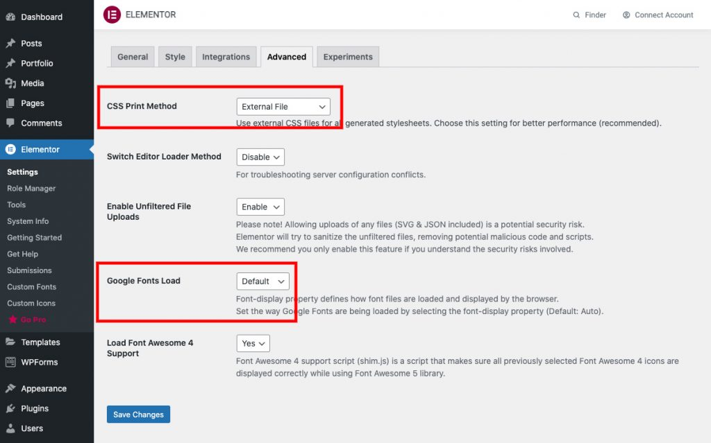

# Elementor Configuration
You have to configuration follow this article to use a custom style.

Please Disable Default Colors and Disable Default Fonts to make Elementor inherit the colors and fonts from the theme.

- CSS Print Method: Select “External File”
- Google Fonts Load: Select “Default”