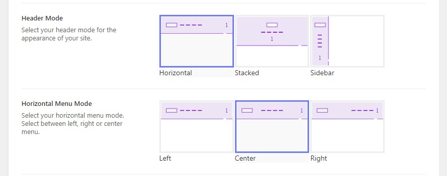
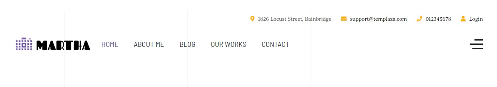

# Header Variations

Templaza Framework offers you different header types, let's find out what they are and which one is the most suitable for your website.

Please go to **WP-Admin > Theme Options > Headers >** Edit the current header or create a new one.

## Header Mode

TemPlaza framework offers you 3 header modes: **Horizontal, Stacked, and Sidebar**

## 1. Horizontal Menu Mode

When you select Horizontal mode then Horizontal Menu mode will appear with 3 options (Left, Center, or Right)

### Horizontal Menu Left

Select the Left option will display the header horizontally on the left as in the image below:

### Horizontal Menu Center

Select the Left option will display the header horizontally at the center as in the image below:

### Horizontal Menu Right

Select the Left option will display the header horizontally on the right as in the image below:

## 2. Stacked Menu Mode

When you select Stacked mode then Stacked Menu mode will appear with 3 options (Stack Center, Stack Separated , and Stacked Divided)

### Stacked Center

Select the Stacked Center option will display the header at the center as in the image below:

### Stacked Separated

Select the Stacked Separated option will display the header at the center as in the image below:

### Stacked Divided

Select the Stacked Divided option will display the header at the center as in the image below:

## 3. Sidebar Menu Mode

When sidebar menu mode is activated, the main menu will display on the left or right sidebar (with a burger menu button to make it collapsible on small screens).

## 4. Sticky Header

In case you want the main menu to display when scrolling down, you can enable the sticky header option. 

* Please go to **Admin > Theme Options > Header >** scroll down to the Sticky section > enable sticky
* There are 3 sticky menu modes: Left, Center, and Right. The main menu items will be aligned to the left, right, or center. You’re supposed to upload a sticky logo as well.

