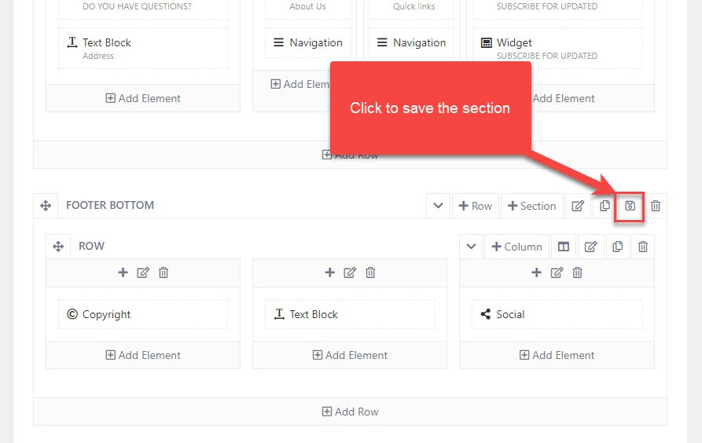
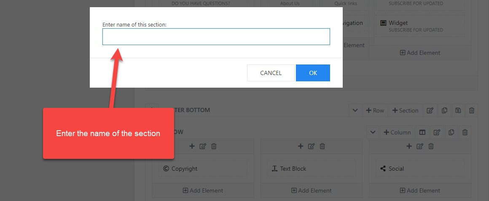
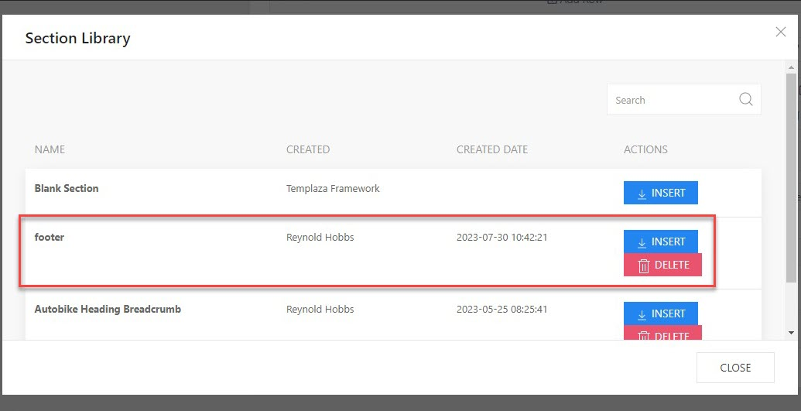

# Save Section

Saving a section is a feature designed to help you copy and save prebuilt sections of a layout to the library. Then you can use them to create new layouts without having to build sections for headers, footers, or templates from scratch. 

When editing a layout, you can click on the 💾 icon to save a section. 

Then a popup appearing allows you to rename the section and save it to the library. 

Add a new footer layout or edit another one, click add a new section, and you'll see the saved section on the section library. Click on Insert to add the section to the layout. 

> The instruction of saving a section above is not only applied to the footer, you can also do the same for the header and template's layout. 

