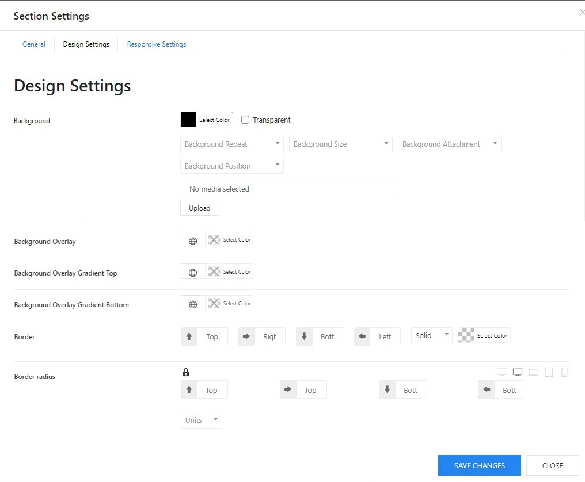

# Section Settings

In layout manager, the first thing you do is to add a section by choosing the grid from the Grid layout manager (if you choose a Custom grid then its sum should always be equal to 12).

After adding the section you see certain options(icons) like **Move section, Section name, Toggle section, Add new row, Add new section, Edit section, Duplicate, Copy section, and Delete.**

If you click on the Edit Section icon, a popup opens that has 3 different tabs below, with these settings, you can customize your sections easily.

* **General Settings**
* **Design Settings**
* **Responsive Settings**

## 1.General Settings

* Admin Label: Input a name for the section
* Section type: Select a type of section. If you create a section for a template or a header, you should choose Default. in case you create a section in the footer layout, just choose Footer option.
* Hide on Single Post: Enable or disable the section on a single post.
* Max width: Choose an option for the max width of the section.
* Remove horizontal padding: Set the maximum content width.
* Container Custom Class: Input a custom class for the container.
* Expand One Side: Expand the width of one side to the left or right while the other side keeps within the constraints of the max width.
* Height:  choose an option for the section's height.
* Vertical Alignment: Align the section content vertically, if the section height is larger than the content itself.
* Custom Z-Index: Input a custom Z-Index value if it's needed.
* Text Align: Set the alignment of the text in the section.
* Custom Class: Write the class name used for writing custom CSS or JS.
* Custom ID: Custom ID can be used for overriding the auto-generated id.

## 2.Design Settings

### Section's background settings

In the design setting tab, you can change the background of the whole section. 

* Background-color: Click on the color swatch and select a color from the color picker.
* Background image: Upload or select an image from the media library.
* Background overlay: Choose an overlay color for the background.
* Background overlay gradient top: Choose a gradient color for the top overlay.
* Background overlay gradient bottom: Choose a gradient color for the bottom overlay.
* Border: adjust the border top, right, bottom, and left of the background. Choose border type and border color.
* Border radius: adjust the border radius of the section background.

### Section's spacing settings

In this part of the design settings, you can adjust the custom margin and custom padding of a section. Switching the device icons to adjust the margin and padding on different devices.

## 3.Responsive Settings

Under this tab, the only option is:

**Device Visibility:** Choose your preference for hiding or showing the section on different screens like 

* **Hide on Extra Small Devices:** Enable to hide the section on mobile phones.
* **Hide on Small Devices:** Enable to hide the section on tablets.
* **Hide on Medium Devices:** Enable to hide the section on laptops.
* **Hide on Large Devices:** Enable to hide the section on desktops.
* **Hide on Extra Large Devices:** Enable to hide the section on large screen desktops.

Responsive settings.
