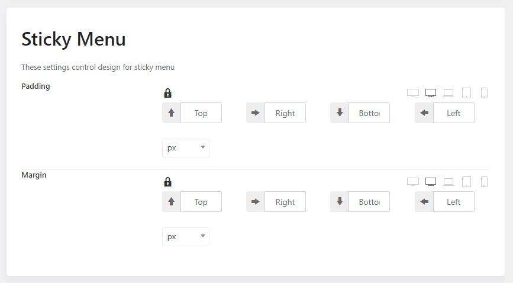

# Sticky Menu

## Enable sticky header

Please go to **WP-admin > Theme Options > Headers >** Edit your header > Header  > Scroll down to the Sticky header section

Enable the sticky header and choose a header mode for the sticky. There are 3 types of the sticky menu mode: Left, Center, and Right.

You can find an option to change the sticky max-width and adjust the padding and border of the sticky header.

## Sticky Logo

After enabling the sticky header, scroll down and upload a sticky logo. You can also be able to configure the type of sticky header on desktops, tablets, and mobile devices.

Moving to the menu section in settings, you're able to control the design for sticky menu.

