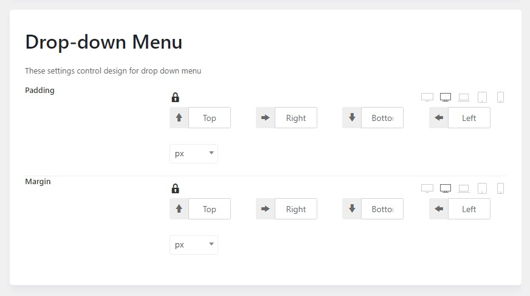

# Menu Settings

TemPlaza framework gives you full control over the design of both the main menu, dropdown menu and sticky menu.

* Please go to **Admin > Theme Options > Settings > Menu**
*You can adjust the padding and margin (top, right, bottom, left) with unit values (em, px, %) to make them match the design beautifully.

You're supposed to switch device icons to adjust the design of the drop-down menu on different devices. 

