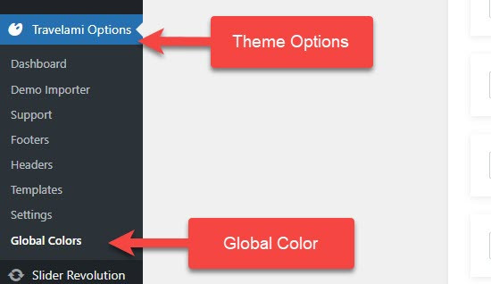

# Global Colors

TemPlaza Framework's global colors enable you to change your colors all in one place and update them everywhere you place them across your entire site.

This prevents you from repeatedly opening website parts and changing them individually.

In **Theme Options > Global Colors**, you can access the global color settings.

## How do I add new groups to global colors?

In specific themes, you can see prebuilt color groups in the global colors. However, you may also need to add other global colors. For instance, if your design calls for a lot of headlines, you may want to create a custom color called “Heading 1” so that all your heading 1 will look the same.

Click on **"Add Color"** to create a list of color attributes for the site's global color settings. 

* Enter the title of the color item (Ex: Primary color or Heading 1).
* Click on Select Color and Select the color you want from the Color Picker.
* Click Choose to apply the color.

## Import/Export Global Colors

### 1.Export global color settings

You can copy/download your current option settings by clicking on the "export file" button in the Export Options. 

It will download a JSON. file to your computer. Keep this safe as you can use it as a backup should anything go wrong, or you can use it to restore your settings on this site (or any other sites).

### 2.Import global color settings

You can use the import color settings if you would like to apply the color options from the current site to other sites. 

In the import options section, click on "Upload File" and upload the JSON. file downloaded before. Or click "Copy to Clipboard" in the Export Options to copy the color code. Then click on "Import from clipboard" in the Import Options to paste the color options. 

