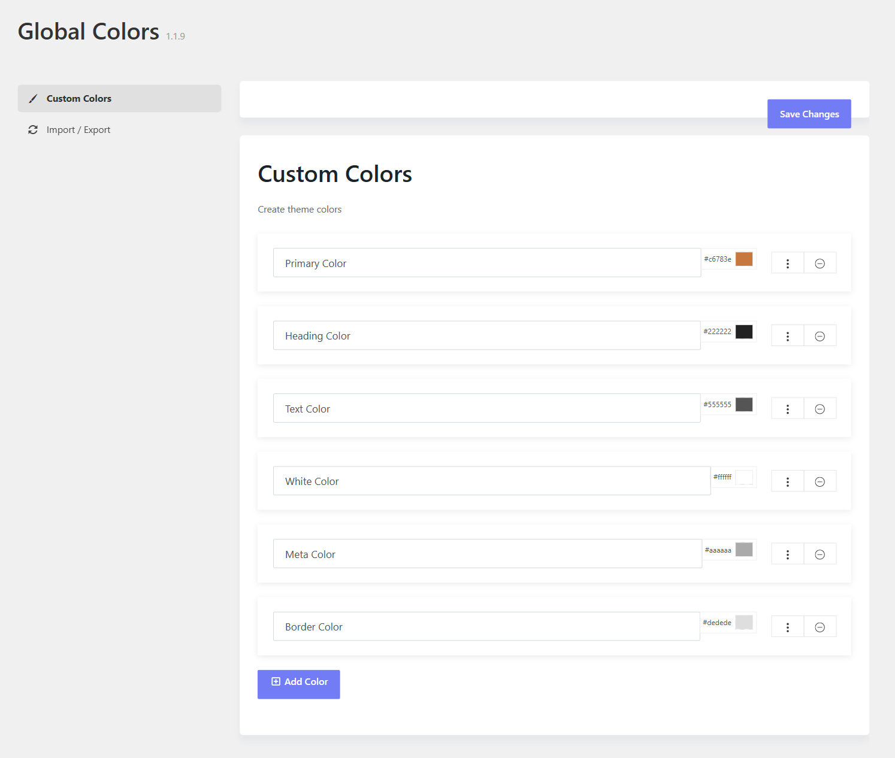

# Global Colors

**Global Colors** are a centralized color management system that allows you to define reusable color variables for your website. Instead of manually selecting colors for every element, you can create a set of global colors and use them throughout your theme, layouts, and widgets.

This ensures:

* **Consistent branding** across your website.
* **Faster design workflow** by reusing predefined colors.
* **Easy maintenance** since updating a global color automatically updates all elements using that color.

> How to locate the global color options: From Theme Options > Global Color > There you can configure your global color palette.

## How Global Colors Work

1. Create a color and give it a meaningful name (e.g., Primary Color, Accent Color, Heading Color).
2. Save the color in the **Global Colors** panel.
3. Use the global color wherever color selection is available within the framework.
4. When you update a global color later, every element linked to that color will automatically inherit the new value.

If buttons, links, and highlights use **Primary Color**, changing it from `#C6783E` to `#0066CC` will update all those elements instantly.

## Custom Colors Section

The **Custom Colors** tab allows you to create and manage your global color palette.

### Color Name

**Purpose:** Identifies the color variable.

**Examples:**

* Primary Color
* Secondary Color
* Heading Color
* Text Color
* Accent Color
* Success Color

Choose descriptive names so the color's purpose is clear throughout the design process.

### Color Value

To define the actual color, you can:

* Click the color swatch to open the color picker.
* Enter a HEX color code manually (e.g., `#222222`).

**Example Colors:**

* `#C6783E` – Brand Accent
* `#222222` – Headings
* `#555555` – Body Text
* `#FFFFFF` – White
* `#DEDEDE` – Borders

### Reorder Colors

Use the drag handle (⋮⋮) to move colors up or down, so as to organizes your color list.

**Tips**

* Place frequently used colors at the top.
* Group related brand colors together.

### Delete Color

If there is an unused global color, Click the **Delete (-)** button beside a color to remove it.

> **Note:** Deleting a global color may affect elements currently using that color.

## Add Color

**Purpose:** Creates a new global color variable.

1. Click **Add Color**.
2. Enter a name.
3. Choose a color value.
4. Save your changes.

## Save Changes

After creating, editing, or deleting colors, click **Save Changes** to store your updates.

# Import / Export

The **Import / Export** feature allows you to transfer global color palettes between websites.

### Export

Exports your current color palette into a file.

Useful when:

* Creating backups.
* Reusing branding across multiple websites.
* Sharing color schemes with team members.

### Import

Imports a previously exported color palette.

Useful when:

* Migrating a website.
* Applying an existing brand identity.
* Synchronizing colors across projects.

# Recommended Global Color Setup

A typical website may use the following color structure:

| Color Name      | Purpose                    |
| --------------- | -------------------------- |
| Primary Color   | Buttons, links, highlights |
| Secondary Color | Secondary actions          |
| Heading Color   | Page titles and headings   |
| Text Color      | Paragraph text             |
| Meta Color      | Metadata and small text    |
| Border Color    | Dividers and borders       |
| White Color     | Light backgrounds and text |

## Best Practices

✅ Use **Global Colors** instead of custom colors whenever possible.

✅ Name colors by their purpose (**Primary**, **Heading**, **Text**) rather than by the color itself (**Blue**, **Red**).

✅ Limit your palette to maintain visual consistency.

✅ Update colors through **Global Colors** when rebranding your website.

✅ Export your color palette as a backup before making major changes.

