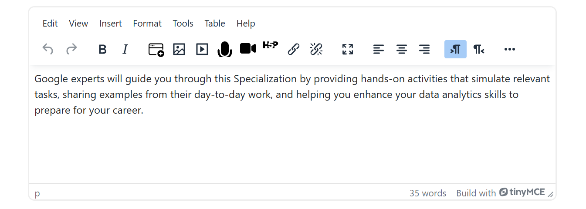
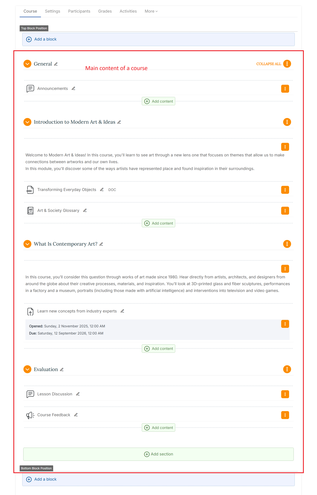
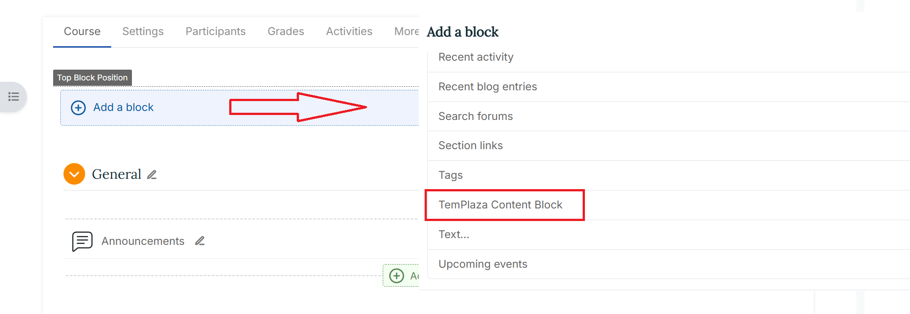

# Adding Content

## General Information

The text editor is a field where you can enter content that will display within your Moodle course.

The default editor is known as the TinyMCE editor in new installations of Moodle 4.2 onwards. An older editor Atto editor is also available but due to be phased out. A plain text editor is also available

The administrator decides which editors to enable or disable in **Site administration > Plugins > Manage editors**. The default editor for all users is the editor listed first. Individual Moodle users can, if allowed by the admin, choose their own text editor from the Preferences link in the user menu top right.

**Please note**: Since TinyMCE is the default editor for the latest Moodle versions, we recommend using this text editor. All of the following examples refer to TinyMCE.

## Block & Resources

In Moodle, a "Text and Media" resource refers to a content module that allows educators to embed a variety of media elements, such as images, videos, and external web content, alongside text. This resource type provides a multimedia-rich experience for learners, enabling the integration of diverse content formats within a single resource. A resource can be added anywhere within the main content region of the course.

Basically the same applies to the Moodle block “Text”. The difference is that a block cannot be placed within the main content region of a course, but only in the specified block positions. However, with Varaham you have the option to position Moodle blocks before or after your Moodle course content.

Here below is an example of a course structure: 

## TemPlaza Content Block plugin

### General information

This is an optional block plugin which offers more setting options than the default Moodle "Text" block. It also allows you to add image slideshows or show course contacts with an easy-to-use interface. It has the standard Moodle Text editor for formatting text, adding images or creating links, switching to code view and allows any valid HTML mark-up to be used. This enables embedding video, sounds and other files which can add unique elements to a course or site page.

### Usage

Enable Edit mode in the top left of the page.
Click the "Add a block" button at the block position where you would like to place the new content block. At the following modal window, choose "TemPlaza Content Block".

**Please note: First you need to set one of the existing block types. The following types are available: Text and Media, Slideshow and Slider. To do so, Click the cog icon in the block header and select "Configure TemPlaza Content Block block". At the following configuration page, you can choose the block type from the dropdown menu at the top.**

### Configuration 

#### Configuration - Text & Media

1. Text Editor: Add the content for your block. It has the standard Moodle Text editor for formatting text, adding images or creating links, switching to code view and allows any valid HTML mark-up to be used. This enables embedding video, sounds and other multimedia elements.

**Background Settings**

2. Background Color: Here you can use the available color picker to select a background color for the content.

3. Background Image: At the Moodle file picker you can upload your own background image for the block.

4. Background Image Property: Specify the size of a background-image. Available options:
   
   - Contain: Resize the background image to cover the entire container, even if it has to stretch the image or cut a little bit off one of the edges.
   - Cover: Resize the background image to make sure the image is fully visible.
   - Repeat: This property sets if a background image will be repeated. This is useful if you would like to use a pattern for the background.
   - Parallax: With parallax scrolling the background image is moved at a different speed than the foreground content while scrolling.

5. Horizontal Image Position: Here you can deinfe the horizontal position for the background image: center, left or right.

6. Vertical Image Position: Here you can define the vertical position for the background image: center, top or bottom.

7. Background Image Opacity: The opacity property specifies the opacity/transparency of the background image.

8. Border Radius: Use this property to add rounded corners to the image.

**Width & Margins**

1. Full Page Width: Mark the checkbox to display the block with the full (main region) page width.

2. Horizontal Spacing inside (padding): Padding is used to create space within an element. Here you can define the amount of horizontal spacing.

3. Vertical Spacing inside (padding): Padding is used to create space within an element. Here you can define the amount of vertical spacing.

4. Vertical Spacing outside (margin): Margin is the space around an element's outer border. Here you can define the amount of vertical spacing.

**Video Settings**

Video: Here you can upload a video file from your local source.

**Where this block appears & On this page**

These settings are part of the general Moodle core settings for blocks. See also: [Block settings - MoodleDocs](https://docs.moodle.org/402/en/Block_settings)

#### Configuration - Slideshow

1. Text Editor: Add further content above the slideshow like a heading. It has the standard Moodle Text editor for formatting text, adding images or creating links, switching to code view and allows any valid HTML mark-up to be used. This enables embedding video, sounds and other multimedia elements

2. Number of Slides: Choose the number of slides for the slideshow. You can define up to 10 slides.

**Slideshow Settings**

3. Autoplay: Select if you want to make a slide automatically advance after a certain amount of time.

4. Autoplay Interval: You can set the interval in milliseconds between switching slides.

5. Transition Effect: You can set the animation option for the transition effect of the slides. Possible values are as follows:
   
   - slide: slides slide in side by side
   - fade: slides fade in
   - scale: slides are scaled up and fade out
   - pull: slides are pulled from the deck

6. Slideshow Navigation Style: Here you can choose between different styles for the slideshow navigation. Available options:
   
   - Arrows (always visible)
   - Arrows (show on hover)
   - Bullet pagination

7. Image Ratio: The slideshow always takes up the full width of its parent container. The height adapts according to the defined ratio. It's recommended to use the same ratio as the background images. For example, just use their width and height, like 1600:1200.

**Slide**

8. Image: You can upload the images for the slideshow via the Moodle filepicker.

9. Heading: Optional: Add a heading to the slide which will appear as a content overlay.

10. Text: Optional: Add a text to the slide which will appear as a content overlay.

11. Content Position & Style: This setting allows you to place the content anywhere inside the slide. Available options:
    - Center
    - Bottom
    - Overlay Left
    - Overlay Right
    - Overlay Bottom
    - Overlay Bottom Right
    For the overlays you can choose between a light and a dark, opaque background color.

12. Button Caption & URL: Optional: This will create a button for your caption with a link to the entered URL.

**Where this block appears & On this page**

These settings are part of the general Moodle core settings for blocks. See also: [Block settings - MoodleDocs](https://docs.moodle.org/402/en/Block_settings)

### Configuration - Slider

1. Text Editor: Add further content above the slideshow like a heading. It has the standard Moodle Text editor for formatting text, adding images or creating links, switching to code view and allows any valid HTML mark-up to be used. This enables embedding video, sounds and other multimedia elements

2. Number of Slides: Choose the number of slides for the slideshow. You can define up to 10 slides.

**Slider Settings**

3. Gap: Select the checkbox if you want the images to be displayed with a small gap between each other. Otherwise the images will be inserted directly next to each other.

4. Slide Set: Define the maximum number of slides that should be visible at the same time. **Please note**: This setting depends on the actual screen width.

5. Navigation Style: Here you can choose between different styles for the slideshow navigation. Available options:
   
   - Arrows (always visible)
   - Arrows (show on hover)
   - Navigation outside

6. Caption/Overlay Style: Here you can choose a style for the slide captions:
   
   - Always visible (white text color)
   - Always visible (dark text color)
   - Always visible (light overlay)
   - Always visible (dark overlay)
   - Always visible (maincolor overlay)
   - Visible on hover (white text color)
   - Visible on hover (dark text color)
   - Visible on hover (light overlay)
   - Visible on hover (dark overlay)
   - Visible on hover (maincolor overlay)
   - Content under slide image
    
**Slide**

7. Image: You can upload the images for the slideshow via the Moodle file picker.

8. Heading: Optional: Add a heading to the slide which will appear as a content overlay.

9. Text: Optional: Add a text to the slide which will appear as a content overlay.

10. Button Caption & URL: Optional: This will create a button for your caption with a link to the entered URL.

**Where this block appears & On this page**

These settings are part of the general Moodle core settings for blocks. See also: [Block settings - MoodleDocs](https://docs.moodle.org/402/en/Block_settings)

### Configuration - Course Contact

**Add link to the profile page**: You can enable this setting option to add a link to the profile page for the users who appear in this block.

The user roles to be shown as course contacts can be defined at the Moodle core "Course contacts settings via Site Administration > Appearance > Courses.

### Configuration - Image Gallery

**Gallery images**: You can upload all images for the gallery via the Moodle file manager.

### Configuration - Pricing Table

**Pricing Tablet Settings**

1. Number of pricing tiers: Define the number of pricing cards which will be displayed (1 - 4)

2. Gap: Mark the checkbox if the pricing cards should be displayed with a padding between them.

**Pricing Card 1-4**

3. Style: Choose a style available

4. Caption: Insert a caption for the pricing card

5. Subcaption: Insert a subcaption for the pricing card

6. Price & Currency: Enter a price amount and currency symbol (ex: $100)

7. Subscription period: Add a period subscription (ex:/month)

8. Description: Insert the description of the pricing 

9. Link text: Insert a link text

10. Link URL: Insert a link URL

11. Tag: Enter a tag for the pricing card

12. Tag style: Choose a tag style

### Configuration - Video

1. Video Settings: Upload a video file from your local.

2. **Where this block appears & On this page**

These settings are part of the general Moodle core settings for blocks. See also: [Block settings - MoodleDocs](https://docs.moodle.org/402/en/Block_settings)

