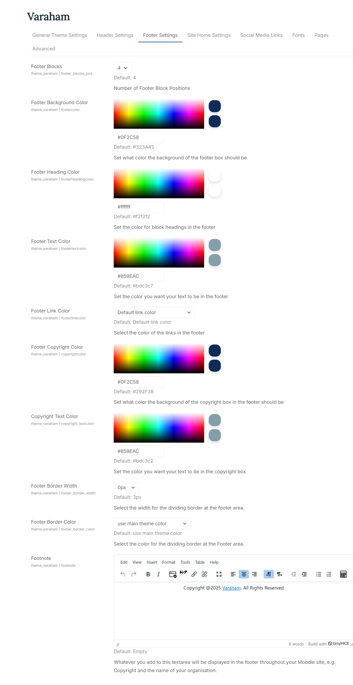

# Footer Settings

1. **Footer Blocks**: 	Here you can define the number of block positions at the footer of the page. At these footer positions, you can add any Moodle block, for example to show activity completion progress or to enhance your core unit content.  Here you can find an overview of the available (default) blocks in Moodle. You can choose a maximum of four block positions for the footer:

2. **Footer Background Color/Footer Heading Color/Footer Text Color/Footer Link Color/Footer Copyright Color/Copyright Text Color**

     With these setting options you can set up the colors for the footer section and the copyright section. For each element you can either use the color picker or enter the color code.

3. **Footer Border/Footer Border Width**: This allows you to define the width and the color for the border at the top of the footer section.

4. **Footnote**: Whatever you add to this textarea will be displayed in the footer copyright section throughout your Moodle site, e.g. the copyright and the name of your organisation.

