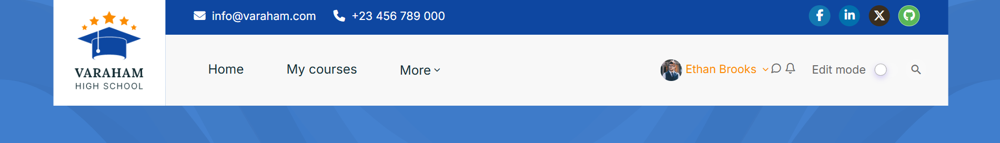

# Getting Started

## Adding a content page

**The "Main menu" block**

To add static pages to your Moodle site, you can use the "Main menu" block.
First, go to the frontpage of your Moodle site and turn editing on ("Administration" > "Turn editing on"). Now:

From the "Add block" dropdown, add the main menu block if it is not already present
At the 'Main menu' block, click "Add an activity or resource" and choose Page. There, you can add your contents and information.

You might want to have the pages at the Moodle custom menu bar instead of being shown in an additional block. With "turn editing on" still enabled at the frontpage, you should see a "Blocks moved into the area below will only be seen by admins" area. Here you can place any Moodle block so that it won't appear at the content area. In the block settings of the main menu block (click on the small cogwheel icon), please select the "hidden" position for *both* "Where this block appears" > "Default region" *and* "On this page".
The main menu block is now hidden for your users, but you can use the links of the "content pages" that you created there for your custom menu (see screenshot in the attachment).

**Opening the menu links in a new tab**

It is possible to open the links at the custom menu in a new tab by adding the target="_blank" attribute to code for the menu like:

`Moodle Homepage|http://moodle.org" target="_blank
`

**Please note**: You mustn't put a closing quote mark on the end of the statement, that will be added by the Moodle renderer and otherwise the link won't work.

## Adding the menu

**Advanced Theme Settings**

An administrator can add the menu via the Moodle theme settings in Site administration > Appearance > Advanced Theme settings.

**Custom menu items**

You are able to create the custom menu by entering custom menu items one per line into the setting. Each item which is preceded by a hyphen (-), will appear on a drop down menu below the previous top level item. So items that are NOT preceded by a hyphen appear on the top level of the menu (always visible).

The content of each item is constructed of up to three bits, each separated by a | (Shift + \) character. The bits are label | url | tooltip.

- **label**: This is the text that will be shown within the menu item. You must specify a label for every item on the menu.
- **url**  This is the URL that the user will be taken to if they click the menu item. This is optional, if not provided then the item will not link anywhere.
- **tooltip**  If you provide a URL you can also choose to provide a tooltip for the link that is created with the URL. This is optional and if not set the label is used as the tooltip for the menu item.

The following is an example of how you would create a custom menu:

Courses
- All courses|/course/index.php
- Course search|/course/search.php
- About us | /mod/page/view.php?id=49
  Pages
- Our Gallery | /mod/page/view.php?id=79
- FAQ Page | /mod/page/view.php?id=155
- Login Page | /login/index.php

## Usability Settings

**Force users to login**

Moodle offers the "force users to login" settings option. Many administrators prefer the Moodle login page to serve as the Site Home for non-logged in users because they want to provide a more "restricted access" look. With this setting option enabled, all visitors and users start at the standard Moodle login page. This implies that they have to login first before they can see any other page of your Moodle site - this includes also the Site Home with the slider and any contents that you might have added there.

A site administrator can change this kind of site policy in "Site administration" > "Security" > "Site security settings". Here, check the option "Force users to login".

**The Moodle Dashboard**

1. About the Dashboard

The Dashboard is a customisable page for providing users with details of their progress and upcoming deadlines. The default Dashboard includes the Moodle core "Timeline" and "Calendar" blocks.

Users can normally customise their personal Dashboard, adding or removing blocks and changing block positions. They can revert their Dashboard back to the original blocks as follows:

- Activate the 'Edit mode' switch.
- Click the 'Reset page to default' button.

`An administrator can reset the Dashboard for all users via Site administration > Appearance > Default Dashboard page.
`

2. Hiding the Dashboard

If deadlines and calendar events are not used in your site then the Dashboard may be removed from the top navigation from Site administration > Appearance > Navigation and unchecking 'Enable Dashboard'. A different home page can then be set for users.

3. Default home page

For new installations, Dashboard is the default home page for logged-in users. An administrator can change the default home page in Site administration > Appearance > Navigation and choose between "Home", "My courses", "Dashboard" or "User preference".

4. Setting the default Dashboard

An administrator or manager can set the default blocks for all users from Site administration > Appearance > Default Dashboard page. Clicking the button 'Reset Dashboard for all users' will then apply these settings to the Dashboard for everyone on the site.

5. Preventing users from customizing their Dashboard

By default, users can customize their Dashboard and add blocks. An admin can prevent this as follows:

- Go to Site administration > Users > Permissions > Define roles
- Edit the authenticated user role and untick the "Manage Dashboard blocks capability"

