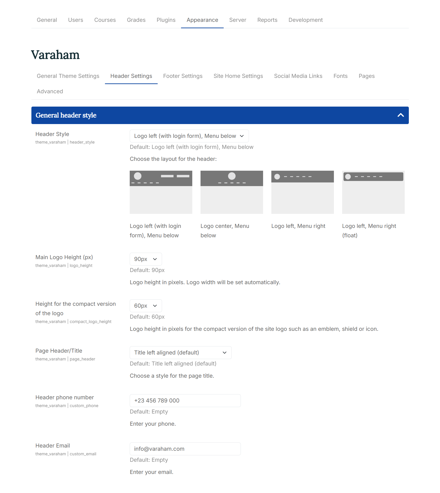

# Header Settings

## Header General Style

1. Header Style: Here you can choose between the layouts available for the header:

2. Main Logo Height (px): Logo height in pixels. Logo width will be set automatically.

3. Height for the compact version of the logo: Logo height in pixels for the compact version of the site logo such as an emblem, shield or icon.

4. Page Header/Title: With this setting option you can choose a style for the page title

The following options are available:
- Title left aligned
- Title centered with divider
- Title with main background color
- Title with main background color and course image

## Colors and background

1. Upload custom header image: At the Moodle file picker, you can upload your own background image. If none is uploaded the defined background color for the header will be used.

2. Repeat header image?: If you have uploaded a tiled background (like a pattern), you should mark the checkbox to repeat the image over the background at the header. Otherwise the image will scaled to be as large as possible so that the header area is completely covered by the background image.

3. Header Color: Background color for the header area

4. Header Font Color: Font color for the header area

5. Header Border: Choose between different options for a dividing border at the header area.

6. Header Border Width: Select the width for the dividing border at the header area.

7. Header Border Color: Select the color for the dividing border at the header area.

8. Custom Menu Color: Background color for the main navigation bar

9. Custom Menu - Links: Color for the links in the main navigation bar

10. Menu Drop-down Items: Background color for the drop-down items of the Moodle custom menu

11. Menu Drop-down Items - Links: Font color for the drop-down items of the Moodle custom menu

## Login & Navigation

With Custom Login Link URL and Custom Login Link Text you can enter a custom URL and a caption for your additional link at the login form. This will override the setting from the dropdown.

1. Custom Menu Home Link: You can choose from the list of available options for the Home link (the first item in the custom menu). Available options:
   
   - Home
   - Short site name (this is defined at the Moodle core [Site home settings](https://docs.moodle.org/401/en/Site_home_settings)).
   - Icon
   - Hide/remove the home link in the custom menu

2. Search box on Navigation Bar: You can choose to show/hide the "search courses" form at the navigation bar with Hide the Moodle breadcrumb navigation for non-logged in and guest users?
   
   - always visible
   - hide for non-logged in and guest users
   - always hidden

3. Breadcrumb Navigation: Would you like to hide the Moodle breadcrumb navigation for non-logged in and guest users? The following options are available:
   
   - always visible
   - hide for non-logged in and guest users
   - always hidden

4. Additional Login Link/ Custom Login Link URL/ Custom Login Link Text: 

Here you can choose to show an additional link at the login form of the theme:
None
   - Link to the Moodle "Create new account" page
   - Link to the Moodle "Forgotten your username or password?" page
   - Link to the Moodle login page

5. Oauth2: Replaces the theme's login form with the Moodle Oauth2 authentication buttons. Depending on the settings, this can be either the login form at the header or the modal login form.
   **Please note**: You have to set up this authentication plugin at the general Moodle settings before it can be used.

