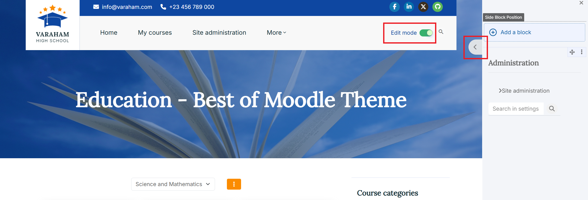
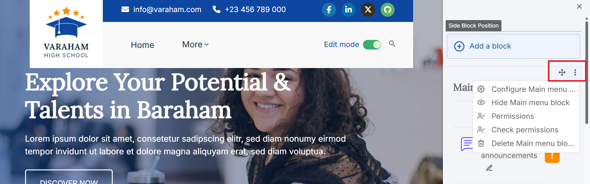
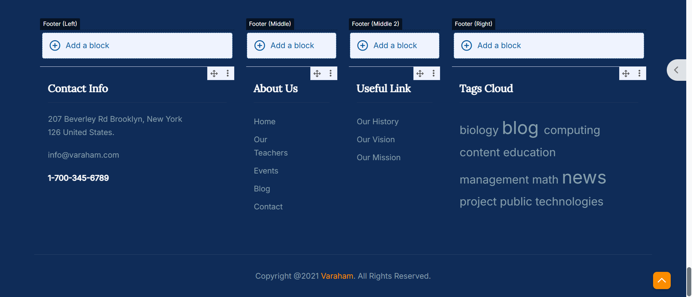
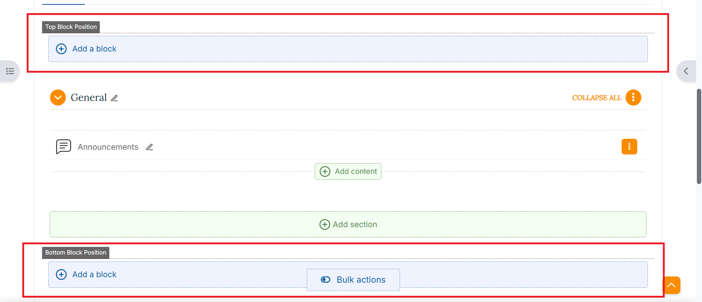

# Managing blocks - General information

Blocks are a type of content items, similar to resources. They are used to provide an overview of the course itself or enhance your core course content. They can be added to the Dashboard and to special Moodle block positions.

[More information on blocks is available at the official Moodle Docs.](https://docs.moodle.org/402/en/Blocks)

## Add and edit blocks in Moodle
Enable Edit mode in the top left of the page.
Varaham offers various block positions. The default Moodle block position is on the right site panel.
Expand the right side panel with the arrow and click the _Add a Block button_.
Select the type of block you would like to add.
Click on block type in the accordion to read a brief description of the function of the block.

**Edit the block settings**

1. Ensure editing is on.
2. Locate the block you would like to edit, click the cog icon in the title section.

3. Others:

   - **Configure block settings**: Settings are different for each type of block. Follow the prompts to customise your block as required and then click Save changes.
   - **Hide/Show a block**: When the eye icon is 'open', the block is displayed in the student view. When the eye icon is crossed out, the block is hidden from student view.
   - **Check permissions**: Set the permissions for different users
   - **Delete a block**: You'll be prompted with a confirmation message before the block is deleted.

**Move a block**

- For the block you would like to move, click and hold the move arrow icon.
- Click and drag the block to the desired new position. A shaded outline will show how the block will look in its new position.
- Release your mouse when you are happy with the block's position.
- The block's new position will automatically be saved.

## Adding Moodle blocks to the footer
`If you add any block at an admin page or at the Moodle Dashboard, it can only be displayed within this context and not throughout the entire site - but that's what you would like for the footer blocks.
  So at first you should return to the Moodle Site Home.`

- Enable Edit mode in the top left of the page.
- Scroll down to the footer section at the bottom of the page.
- Click the "Add a block" button at one of the footer's block positions.
- Select the calendar block in the following menu.
  
  

## Blocks within courses

With Varaham, you have the option to position Moodle blocks before or after your Moodle course content. A course instructor can use this to create useful course information blocks or contents to enhance the course design.

The "Top Block Position" and the "Bottom Block Position" are available for the main course page as well as for the Moodle "Page" and "Book" resource type.

