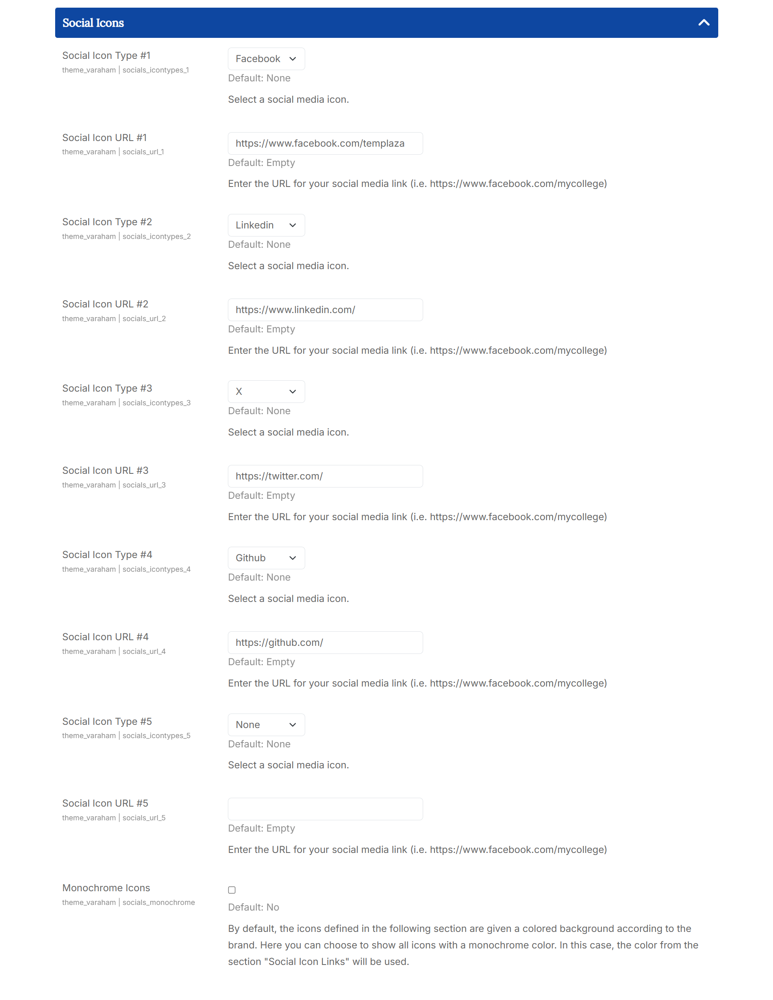
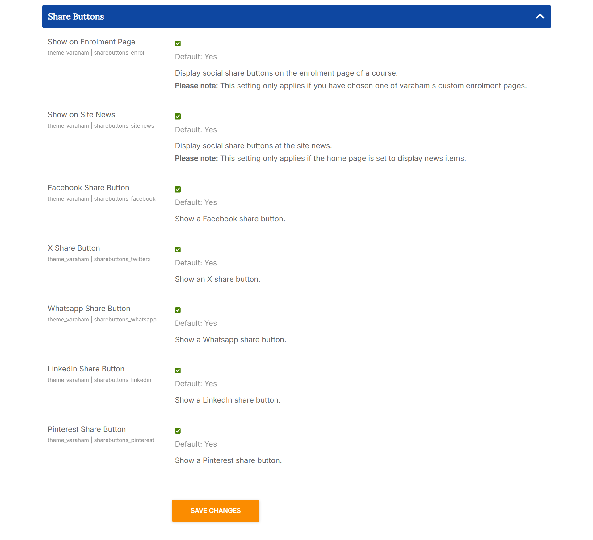

# Social Media Links

## Position and Background Color

1. Icons Position: You can choose where to place the social media icons: At the bottom of the page (footer bottom), above the footer (footer top) or at the top of the page (header).

2. Social Icons Background: You can between different background colors for the social icons at 'header' position:
   
   - fully transparent (use header background)
   - slightly dimmed
   - main theme color
   - secondary theme color
   - footer copyright background
    
## Social Icons

1. Social Icon Type: In the Theme Options you will see several textfields, one for each included social network. In those fields you should copy/paste the URL to your social network profile (i.e https://www.facebook.com/templaza):
   Social Icon URL
   
2. Monochrome Icons: By default, the icons defined in the following section are given a colored background according to the brand. Here you can choose to show all icons with a monochrome color. In this case, the color from the section "Social Icon Links" will be used.

## Additional Icon Links

1. Additional Icons Color: Here you can use the Moodle color picker to define a color for the additional icons.

2. Additional Icons Text Color: Here you can use the Moodle color picker to define a text color used for the additional icons.

3. Additional Link Icon/Additional Link Text/Social Icon URL: With these setting options you can define up to three additional icons with (optional) texts and hyperlinks
   Icon and text with the given hyperlink will then show up at the selected position for the social icons.
   
## Share Buttons

At this section you can enable different share buttons and choose where they should be displayed.

