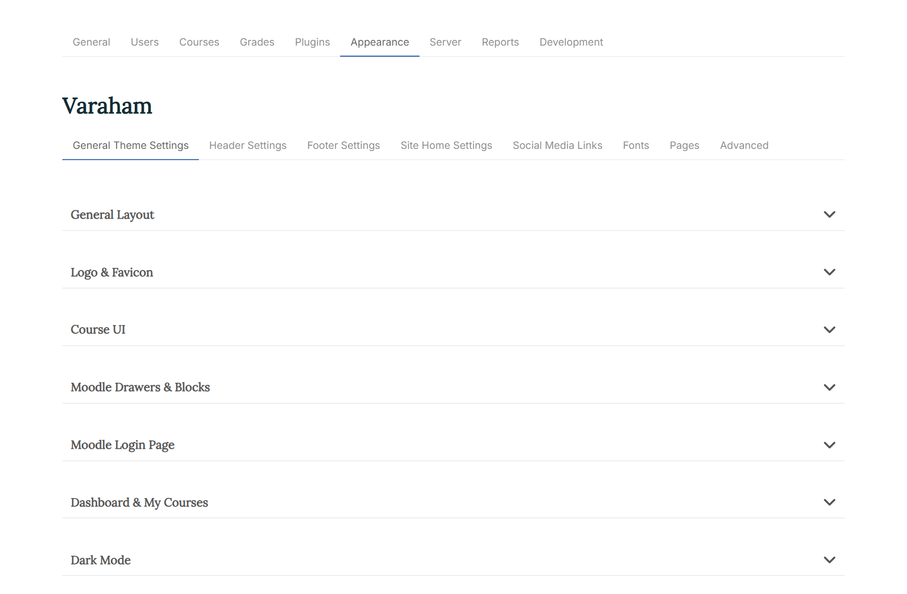
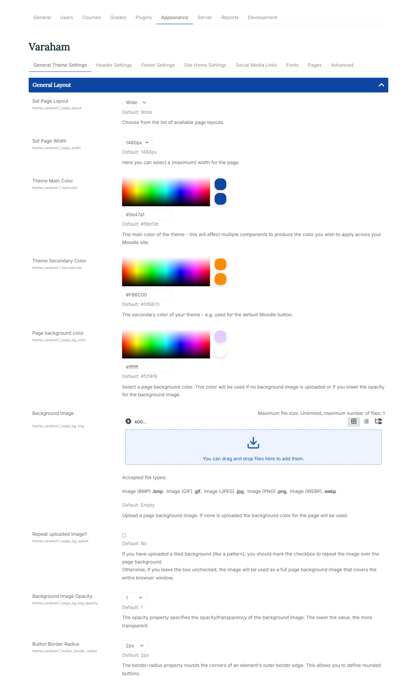
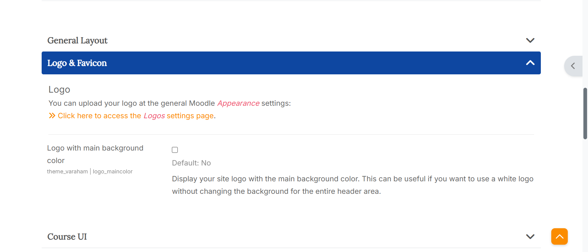
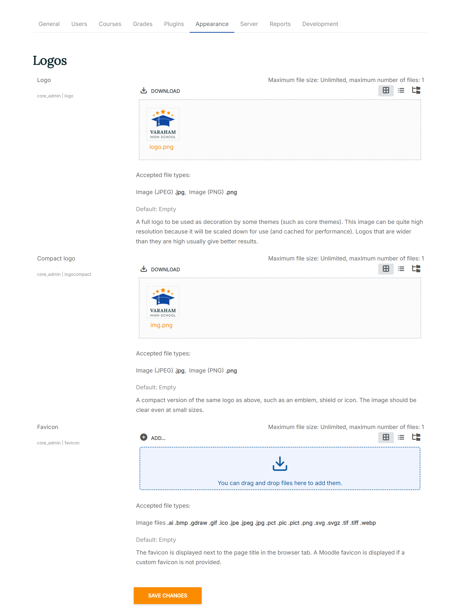
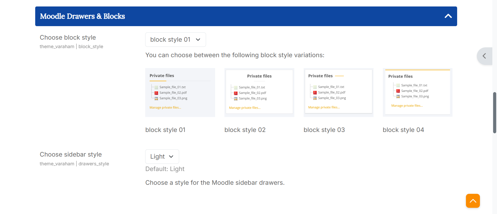
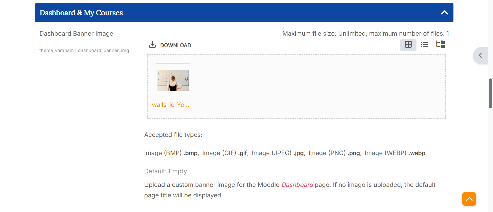

# Theme Options

To access the configurable options for Theme Varaham go to Site Administration > Appearance > Themes > Varaham.

Varaham's settings page is structured via tabs fo each section at the top. You can expand/collapse the sub-sections to access the configurable setting options.

## General Settings

### General Layout

1. **Set Page Layout/Set Page Width**: You can choose between a "boxed" and a "wide" page layout. For both options, you can define a (maximum) width for the page.
   
2. **Theme Main Color/Theme Secondary Color/Page background color**: For each element you can either use the color picker or enter the color code.

The main color of the theme affects mulitple components to produce the color you wish to apply across your Moodle site.
The secondary color of your theme is used for the default Moodle button.
The page background color will be used if no background image is uploaded or if you lower the opacity for the background image.
  
3. **Background image**: At the Moodle file picker, you can upload your own background image. If none is uploaded the defined background color for the page (see above) will be used.

4. **Repeat uploaded image?**: If you have uploaded a tiled background (like a pattern), you should mark the checkbox to repeat the image over the background at the header. Otherwise the image will scaled to be as large as possible so that the header area is completely covered by the background image.
   
5. **Background Image Opacity**: The opacity property specifies the opacity/transparency of the background image. If you reduce the opacity for the background image, the defined background color (see above) will also appear.

6. **Button Border Radius**: This property rounds the corners of all buttons at your Moodle site.

   

### Logo & Favicon

1. Logo: You can upload your logo at the general Moodle "Appearance" settings. The settings there are for defining two variants of a logo to be used as part of the interface for your site.

A full logo to be used as decoration by some themes (such as core themes). This image can be quite high resolution because it will be scaled down for use (and cached for performance). Logos that are wider than they are high usually give better results. Formats accepted: PNG and JPG.
A compact version of the same logo as above, such as an emblem, shield or icon. The image should be clear even at small sizes. Formats accepted: PNG and JPG.

2. Logo with main background color: Display your site logo with the main background color. This can be useful if you want to use a white logo without changing the background for the entire header area.

3. Favicon: A favicon is an icon typically displayed in the address bar of a browser accessing the site or next to the site name in a list of saved bookmarks. Images with a transparent background and 32px height will work best. Formats accepted: PNG, JPG and ICO.

### UI Course

1. Course Title: Choose how to display the title of a course for the main course page. Available options:

- Default (like common page title)
- With course image banner
- Hide course title

Hiding the course title can be useful if you want to prevent further scrolling before the course content is displayed, or if you want to use a custom course title in the main region area.

2. Course Banner Height: If you have selected the option "with course image banner" for the course title, you can specify a height for the banner image here.

3. Moodle Activity Icons: Activities are interactive tools used to engage students in learning and assess their progress. Here you can choose between different designs for the activity icons within your courses. Available options:

- Default
- Moodle contextual icons: This setting option depends on your Moodle version. You can either switch to a contextual background color (Moodle 4.4 - 5.0) or to a contextual line color (Moodle 4.0 - 4.3).
- Monochrome
- Main background color with dark icons
- Main background color with bright icons
- Secondary background color with dark icons
- Secondary background color with bright icons

4. Activity Navigation Buttons: With this setting option you can display additional navigation buttons (back to course, previous, next) at the bottom of a course activity or resource.

5. Choose a layout for the courses in the course category view. You can select to show your courses in a list or in a grid view. 

6. Category style for list of courses: With this settings option you can choose a style for the course categories at the Moodle course index page. With the default settings, Lambda uses a course orientated presentation which displays all courses within a certain category - this also includes courses of a subcategory. A filter for the available categories can be found at the right column of the page. Other available options:

- Courses only with categories as filters
- Default Moodle category list
- Show course categories as cards
- Show course categories as tiles with images

To define an image for the category tiles (setting option no. 4), simply add an image to the Moodle course category description. To read more about the Moodle core category management, see also:  Course categories at the official Moodle docs.
Varaham will use the first image at the category description for the category tile. If no image can be found, one of the course images within the category will be used instead.

**Course Enrolment Page**

1. Enrolment Page Layout: Course enrolment is the process of marking users as participants in the course. On the course enrolment page, users can see the course details, but they cannot take the course yet. Available options:

Default Moodle course enrolment page
Varaham custom course enrolment page (small course image)
Varaham custom course enrolment page (large course image)
Varaham custom course enrolment page (hero course image)

At the custom course enrolment page you can also show the course tags. You can take a look [here at the official Moodle docs](https://docs.moodle.org/403/en/Course_settings#Tags) to learn more about adding course tags.

2. Course overview on Enrolment Page: If this setting is enabled, the course sections will be displayed on the enrolment page along with a list of the activities and resources available within them. Access to the course content is, of course, only possible after enrolment.

3. Course Custom fields on Enrolment Page: Choose where you would like to show the optional course custom fields. Check the box to display the course custom fields only on the enrolment page. This might be useful if you are using multiple course custom fields.
   Otherwise, they will be also displayed at the course list layout.

You can take a look [here at the official Moodle YouTube channel](https://www.youtube.com/watch?v=D5mhgTiWcWg) to learn more about custom course fields.

4. Term Free Courses: If you offer paid courses on your learning platform, you may also want to promote free courses. In this case, you can enter the relevant text here (e.g. “Free offer!”). Schools and universities can leave this text field blank if all courses are freely available anyway.

### Moodle Drawers & Blocks

1. Footer Blocks: You can choose between 4 block style variations available.

2. Choose sidebar style: You can choose between a light and a dark style for the Moodle sidebar drawers.

### Moodle Login Page

1. Moodle Login Form Position: You can choose between different positions for Moodle login form. Available options:

- centered login form
- left aligned login form
- left aligned with outer spacing
- right aligned login form
- right aligned with outer spacing

2. Login Page Hide Username/Password Form: If you prefer that your users login with other existing accounts (e.g. Google), then you can check this box to hide the default username/password form. An additional button will be displayed to show/hide the form.

3. Moodle Login Page Background: Here you can choose between different options for the background of the Moodle login page. Available options:

- Background image
- Background slideshow (up to four images)
- Full screen video background
- Custom background color

4. Login Page Background Image/Color: Depending on your choice for the "Moodle Login Page Background" setting (see above), you can either use the Moodle file picker to upload your background images or a video file (mp4), or define a background color using the color picker.

### Dashboard & My Courses

1. Dashboard Banner Image: Here you can upload a custom banner image for the Moodle Dashboard page. If no image is uploaded, the default page title will be displayed.

2. Dashboard Info Stats: When you check the box, your users will see a statistics block at the top of the Moodle Dashboard page. The information depends on the user role: An administrator will see site information such as the number of courses available or online users. A student will see the number of courses enrolled or completed.

3. Dashboard Block Columns: Here you can choose between different block region layouts for the Moodle Dashboard page. Available options:

All blocks with 100% width (default)
All blocks with 50% width (masonry)
First block 100% width, following blocks 50% width (masonry)
Last block 100% width, previous blocks 50% width (masonry)

4. My Courses Banner Image: Here you can upload a custom banner image for the Moodle "My Courses" page. If no image is uploaded, the default page title will be displayed.

5. Banner Height: Select a height for the optional banner image at the Moodle Dashboard or "My Courses" page.

### Dark Mode

1. Enable Dark Mode: If you enable varaham's Dark Mode setting, then the Moodle core user menu will be enhanced with an additional item to turn of/off the dark mode.

2. Font Heading Color, Font Body Color, Link Color, Header Color, Page background color, Footer Background Color, Footer Copyright Color, Footer Text Color, Logo Background Color:
   
   With these settings, the administrator can customize the appearance of dark mode so that the colors match the branding of the learning platform.
   These changes are not accessible to other users.