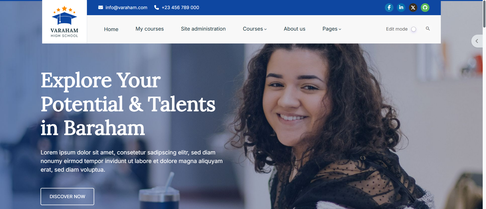
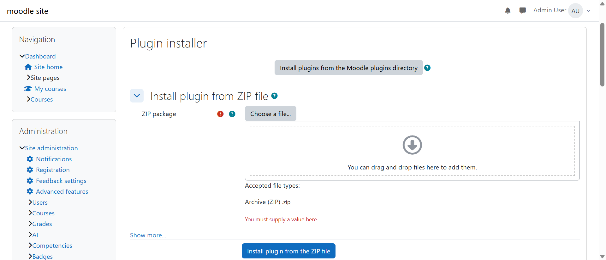
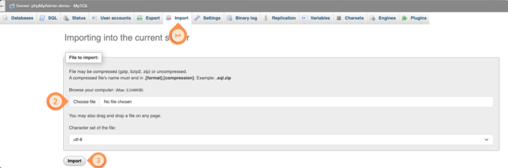
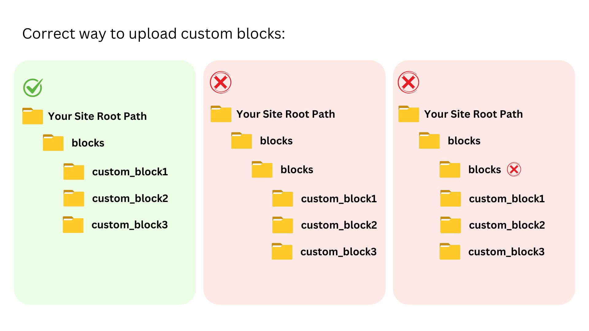
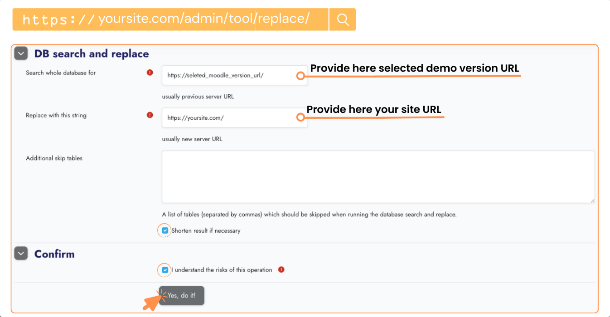

# Varaham Introduction

**Varaham - Education & Online Courses Moodle Theme**

Varaham is a modern Moodle education theme for your website. It is a stunningly flexible, perfect and extensive education theme which is the perfect solution for those who love to represent their organization such as school, college, training courses, corporate training, university etc…

It is 100% responsive, clean, sharp fluid, exclusive theme. It provides more customizable sections in the front page which users can customize through the backend setting panel.
It offers many customizable features and is enhanced and updated regularly with new features.

First, thank you for choosing Varaham theme for Moodle. Varaham is a Bootstrap based theme with a sharp design and it offers various style and layout options. I hope that you will be satisfied with it.

This documentation should help you get started. It covers everything you need to know to get the theme up and running. Please read this documentation thoroughly, if you still experience any difficulties please get in touch via support email support@templaza.com or access to our ticket system:

[Support Varaham Moodle Theme](https://www.templaza.com/tickets.html)

## Installation & Demo Import

**Upload Theme**

Upload and install via ZIP file
1. Login to your Moodle site as an admin.
2. Go to Site administration > Plugins > Install plugins.
3. In your downloaded package from ThemeForest, open the folder Theme. Choose the appropriate upload file for your Moodle version:
4. Upload the ZIP file in the folder.
5. Check the plugin validation report, then click the button 'Install plugin'.

**Install Plugins**

1.Upload these plugins: block_templaza.zip and tiny_templaza.zip

## Import Demo Content
Follow these steps to successfully install the Varaham's demo content on your Moodle site.

### Step 1: Create a Database

1. Log in to phpMyAdm
2. Create a new database

### Step 2: Import Demo SQL File

1. Open your newly created database in phpMyAdmin. 
2. Click on Import.
3. Choose and import the varaham.sql file (extracted from the demo package).

### Step 3: Upload Files

1. Inside the unzipped demo folder, open the links.txt file to get the download link for demo_files.zip.
2. Download demo_files.zip.
3. Upload and extract it on your web server (e.g., inside var/www/htdocs/ or your domain root).

**Alternative Method:**

Use an FTP client like FileZilla to upload the extracted demo_files folder to your web server.
Then upload the following:

   - varaham.zip (theme file) → into: /demo_files/theme/
   - blocks.zip (all blocks) → into: /demo_files/blocks/

###  Step 4: Upload Moodle Data Files

1. Open the links.txt file to find the download link for moodledata.zip.
2. Download moodledata.zip.
3. Upload and extract it outside your webroot (e.g., /var/www/moodledata/).

**Important: Ensure the moodledata directory has read and write permissions.

### Step 5: Configure config.php

1. Open the config.php file located in your Moodle root directory.
2. Update the following:
   
   -`$CFG->dbuser, $CFG->dbpass, $CFG->dbname` – set your DB credentials.
   
   -`$CFG->dbhost` – usually `localhost` or `127.0.0.1.`
   
   -`$CFG->wwwroot` – use your actual site URL.
   
   -`$CFG->dataroot` – path to your moodledata directory.
   
   -`$CFG->directorypermissions` – typically `0777` or `0755`.
   
###  Step 6: Log In

1. Visit: {your-site-url}/login/index.php
2. Use the following admin credentials:
   Username: admin  
   Password: password
   
### Step 7: Search & Replace Old URLs

1. Go to: {your-site-url}/admin/tool/replace/
2. Enter the old URL (based on the original setup):
   ex: https://varaham.dev.site
   
3. Replace it with your current site URL, e.g.:
   https://yourdomain.com/

   
4. Click Submit to complete the URL update.

### Step 8: Purge Moodle Cache

1. Visit: {your-site-url}/admin/purgecaches.php
2. Click "Purge all caches"

This may take a few minutes. Be patient.

### Final Step: Change Admin Password
For security reasons, please change the administrator password after your first login.

## Changing the default theme

**The theme selector**

An administrator can set a theme for the site from Site **_administration > Appearance > Themes > Theme selector_**.

Go to **_Site administration > Appearance > Themes_**

- Click on the **_"Select theme"_** button on the preview of each theme.
- Scroll down to see the previews of the available themes and click on the "Use theme" button to choose the theme
- The next screen will provide information about the theme. Click "Continue"

`Note: The selected theme may be overridden if user/course or category themes have been allowed in the Moodle core theme settings.
`