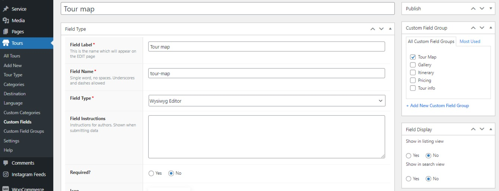
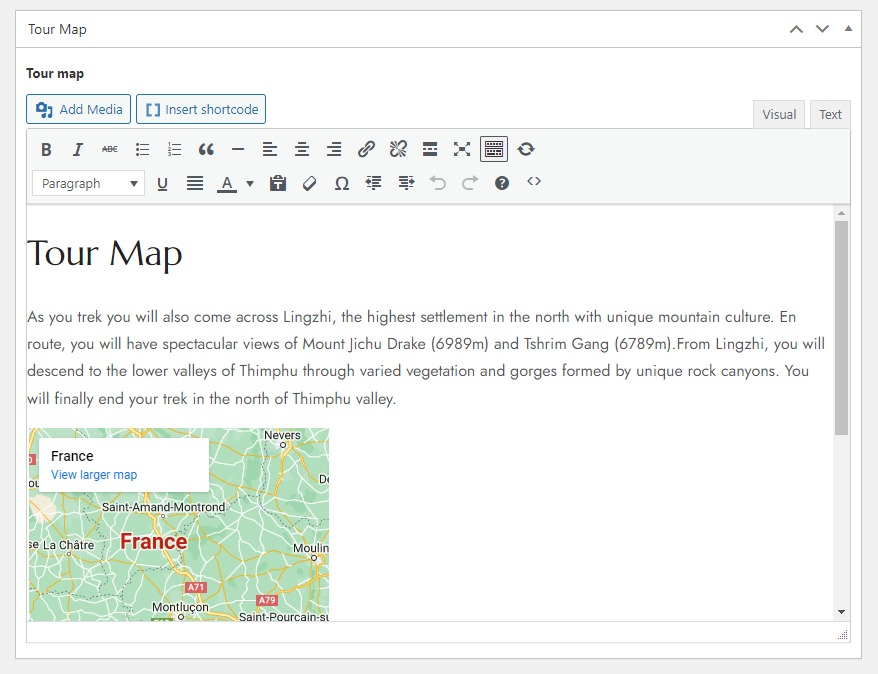

# How to add a new court

## How To Create A New Court

After adding branches, destinations, languages, field groups, and custom fields, you're ready to add new tours. Go to Wp-admin > Advanced Products > Add new.

## Tour Properties

In the tour properties, you can choose a branch of the tour, and upload the tour's image gallery. 

## Tour Map

First you need to add a new field for tour map, please go to Tours > Custom Fields > Add New. 

* Field label: Tour map
* Field type: WYSIWYG Editor
* Assign the tour map to a field group

The tour map field will display in the article like below, you can input the content for this field. 

## Tour Info

The tour info section contains several custom fields including Language, Destination, Departure, Physicality, Duration, and others. 

