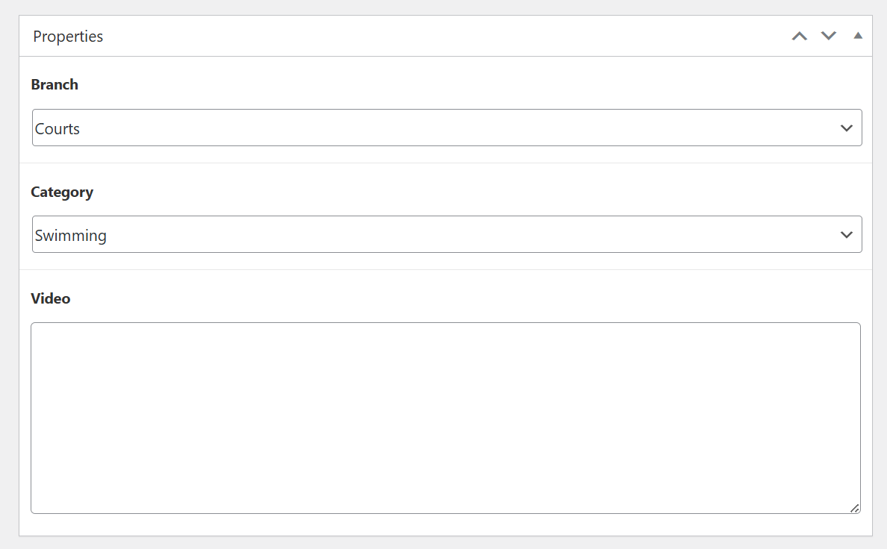
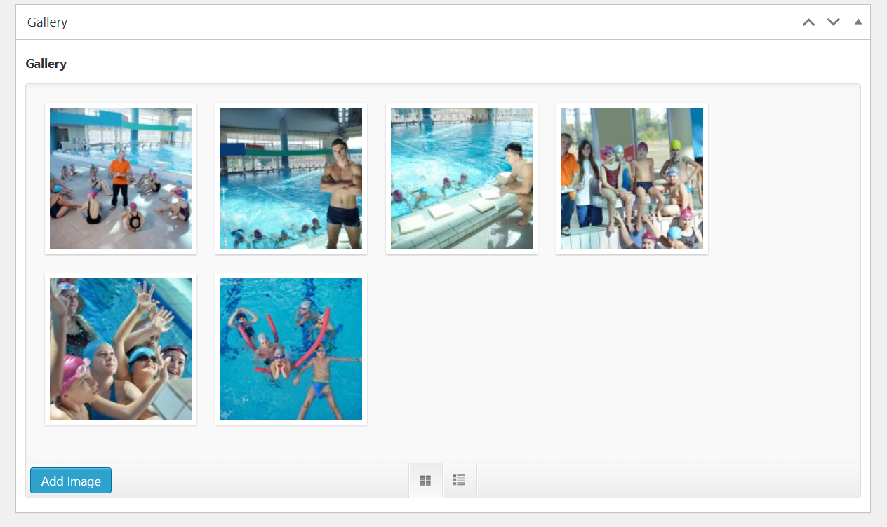
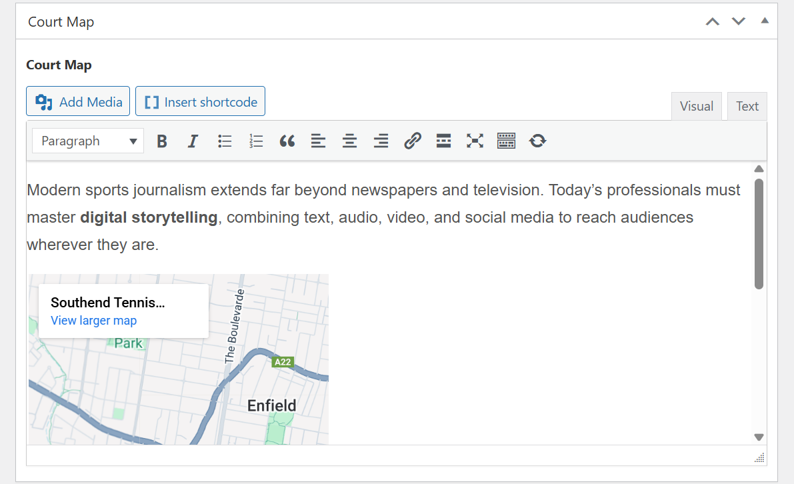
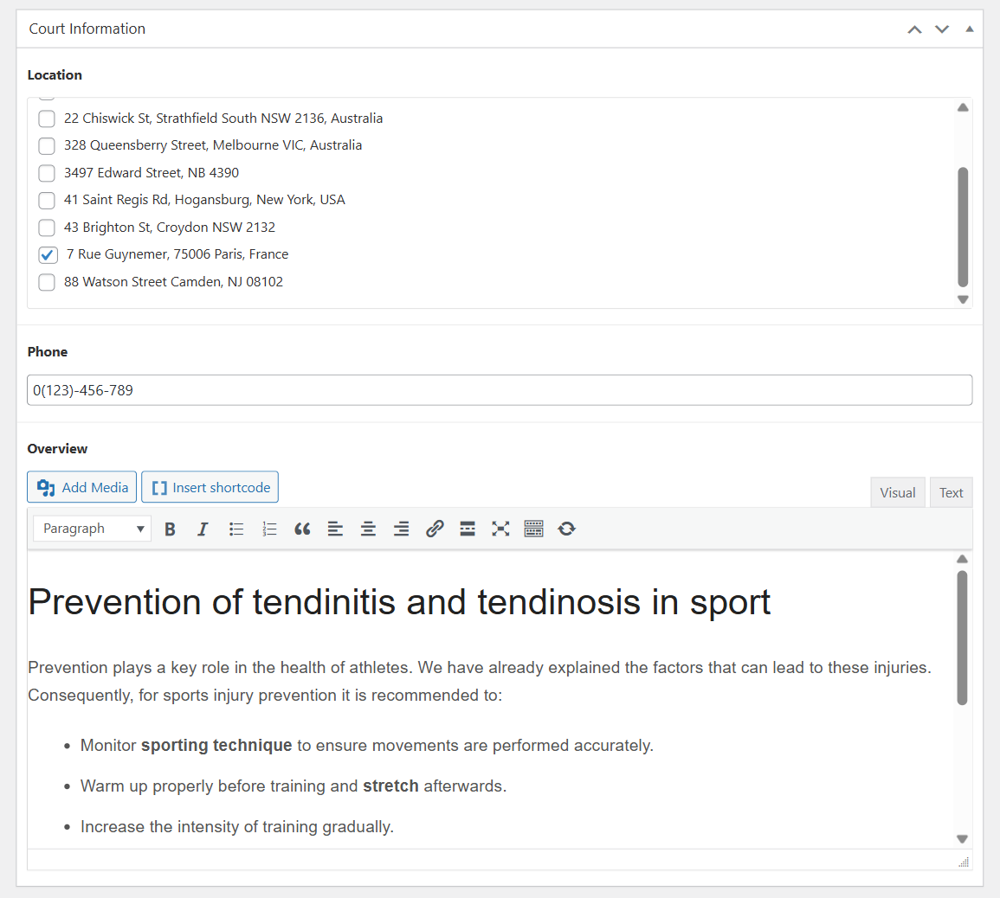

# How to add a new court

## How To Create A New Court

After adding branches, destinations, languages, field groups, and custom fields, you're ready to add new courts. Please go to Wp-admin > Advanced Products > Add new.

## Court Properties

In the Court properties, you can choose a branch, and a category for a product.

## Court Image Gallery

Upload image gallery for a court.

## Court Map

First you need to add a new field for court map, please go to Advanced Products > Custom Fields > Add New. 

* Field label: Court map
* Field type: WYSIWYG Editor
* Assign the field to a field group

The court map field will display in the article like below, you can input the content for this field.

## Court Information

The Court information section contains several custom fields including Location, Phone, and Overview. 
You can also assign other custom fields to the Court Information group, so they can be displayed in this section. 

