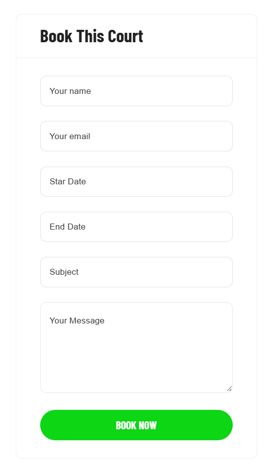
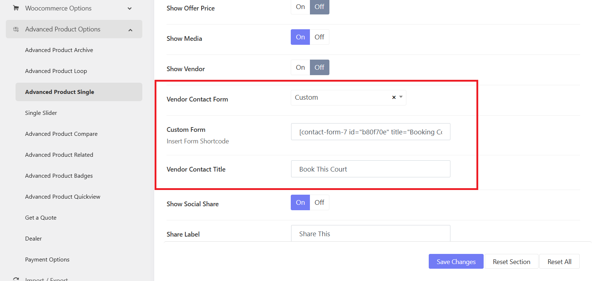

# Court Booking Form

## Edit / Customize the booking form
 
The Court's booking form is created with Contact Form 7, so you can go to WP-admin > Contact > Edit Booking Court Form. 

But you can also create a booking form with WPForms, WP-admin > WPForms > Add New Form

> Refer to the Contact Form 7's documentation to learn more about the configurations: [https://contactform7.com/docs/](https://contactform7.com/docs/)
> Refer to the WPForms' documentation to learn more about the configurations: [https://wpforms.com/docs/](https://wpforms.com/docs/)

## How to assign a form as a booking form

When you create a new booking form and want it to replace the current form, please go to **Sports Options > Settings > Advanced Products options > Advanced Products Single**

* Vendor Contact Form:  Choose a form (that you created with WPForm). Or if you're interested in integrating Contact Form 7, you can choose "Custom" option.
  Then add the shortcode of the form into the "Custom Form" field.
* Vendor Contact Title: Change the booking form title.

> To change the "Book Now" call-to-action button, you can edit it in the booking form in WPForm or Contact FOrm 7. 

