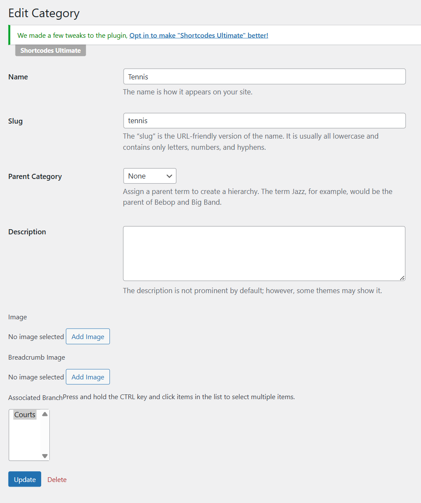

# Court Category

You can create different categories to represent different types of sports like Tennis, Pickle ball, Swimming, Football, Volleyball, Badminton and so on. 

Go to WP-admin > Advanced Products > Category > Add new. You should assign each category to a branch.

Court category is linked to the Category field in the custom fields. The category is a protected field, so you can edit the field label, and others except for its field name and field type. 

