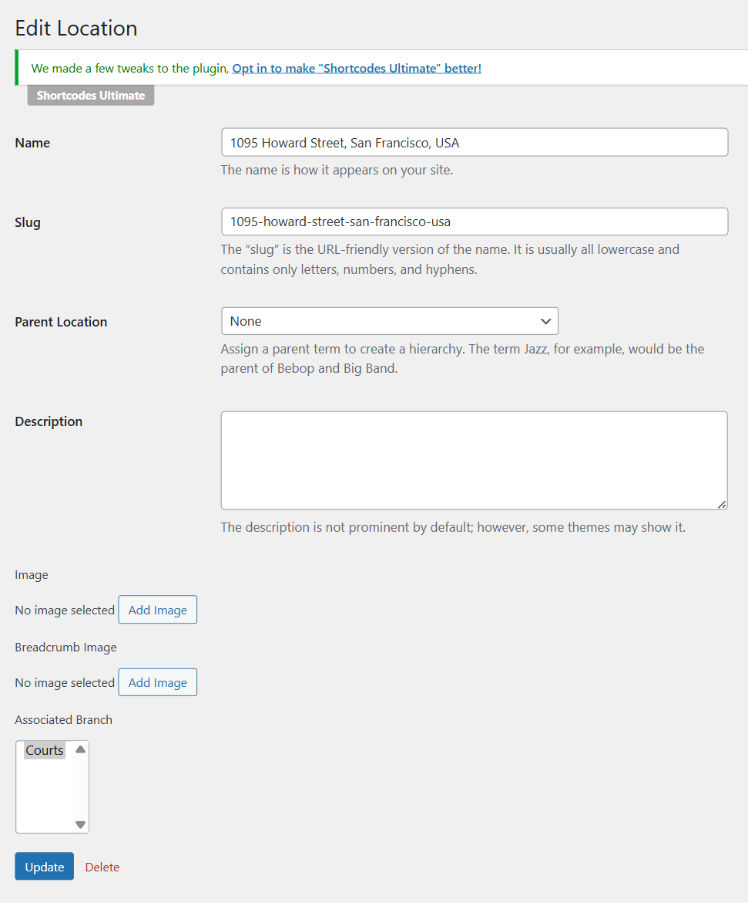

# Court Locations

To create  court location, please go to WP-admin > Advanced Products > Locations > Add a new location. Each location should be assigned to a branch.

## How to translate the "Location" text

Court location is created under custom category. You should go to Advanced Products > Custom categories > edit the Location there.

After that, you should go to Custom fields > Navigate Location field > Edit the field there as well. 
