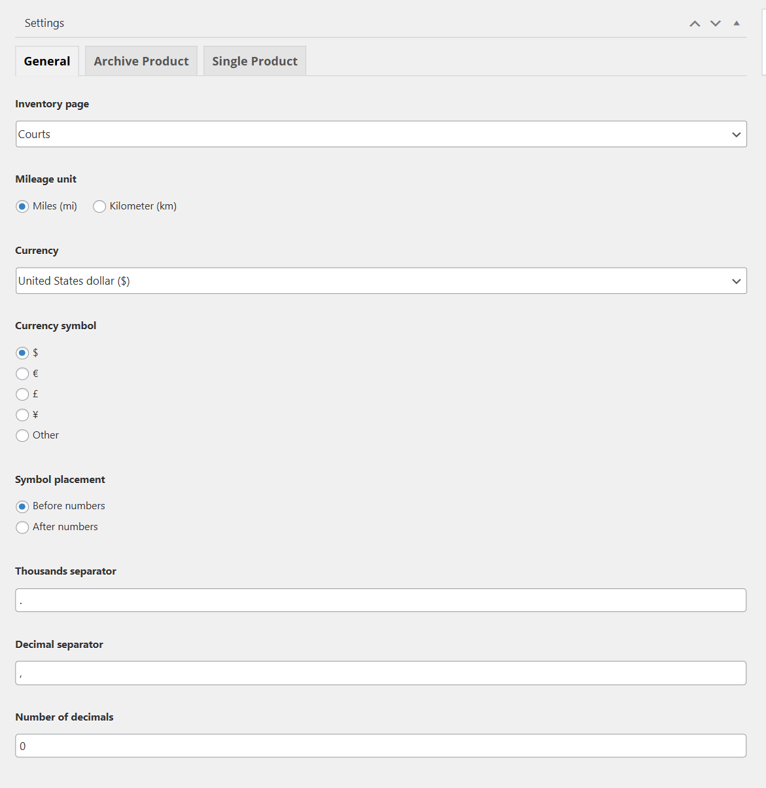
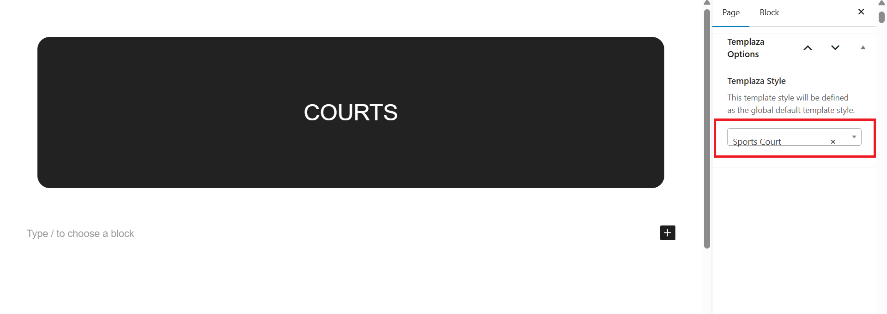
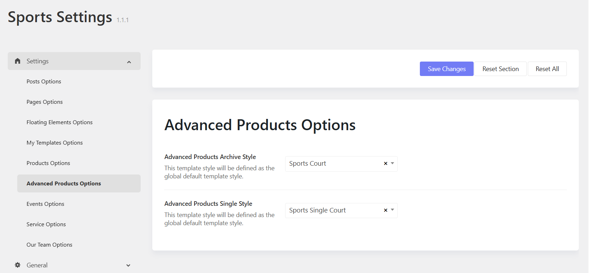
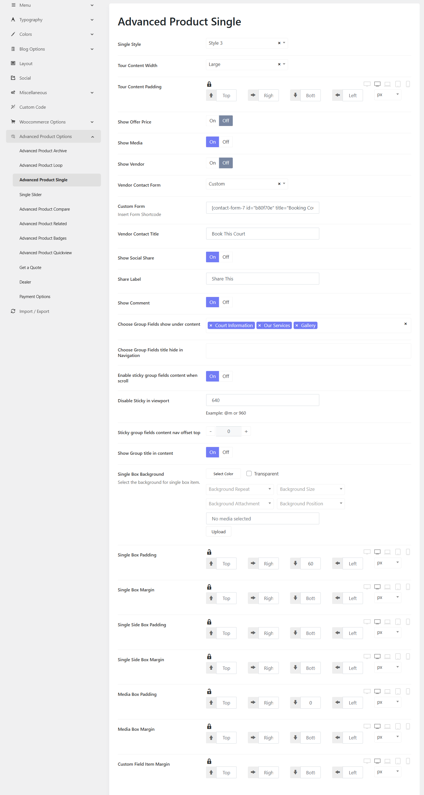

# Choose a court page

To showcase your court page, you should go to Advanced Products > Settings > General tab > Choose an Inventory page from the list. 
If you haven't had a court page in the list, please go to Pages > Add a new one. 

# About the Court page

The Court page should be assigned to the TemPlaza Style: Sport Court. 
You can go to Pages > Navigate and edit the Court page > then on the right sidebar, you can see TemPlaza Style option > Choose Sport Court. 

# About Single Court Page

To assign a template style for single cour page, you should go to Sports Options > Settings > Settings > Advanced Products Options.
You can assign archive advanced product pages and single advanced product page to templates.

1. Advanced product archive style: Sport Court
2. Advanced product single style: Sport Single Court

It means all the archive pages of advanced products will inherit the Sport Court layout, while single court pages will be applied to the Sport Single Court layout. 

*Single Court Page Options*

Please go to Sports Options > Settings > Advanced Products Options > Advanced Products Single.
Here you will find options to configure for single court pages. 

