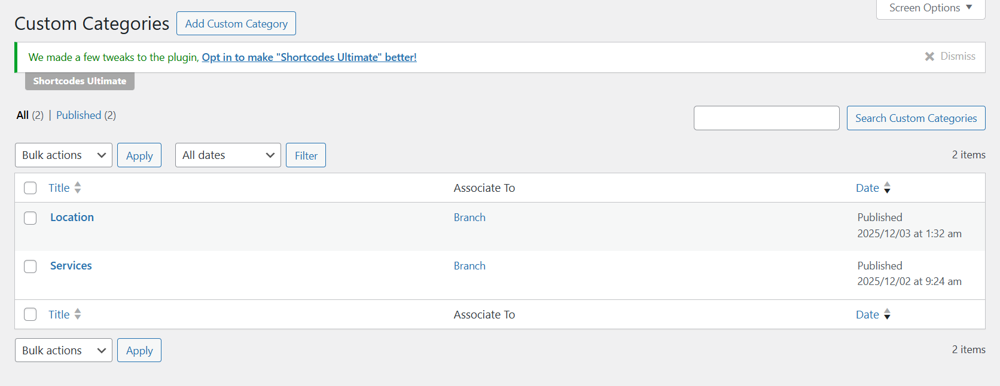

# Court Services

## How to add a new service

Please go to WP-admin > Advanced Products > Services > Add new

Enter the service's title, upload the service image, and assign the service to a branch.

## How to translate "Service"

The service menu is created under Custom Categories. You should go to Advanced Products > Custom categories > edit the Service category there.

After that, you should go to Advanced Products > Custom fields > Navigate the Service field > Edit the field there as well.