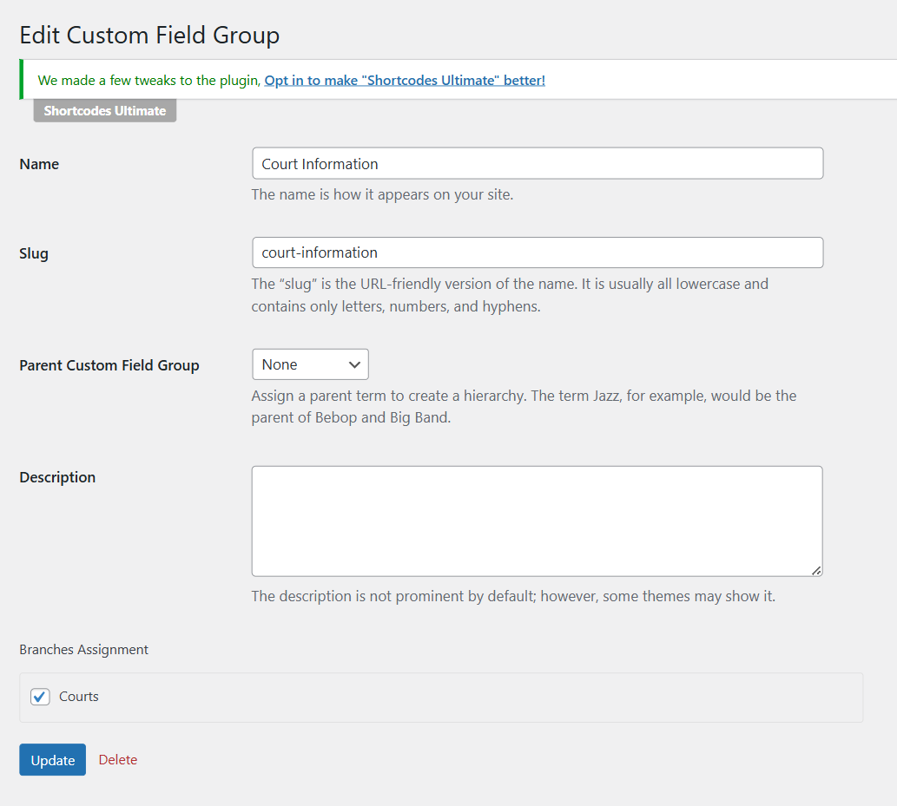

# Tour Custom Field Group

Field groups are created to attach fields to Court articles. Each field group contains a title, Slug, Parent Custom Field Group, Description, and Branch Assignment.

## Creating a New Field Group

Go to Advanced Products  > Custom Field Groups > Click Add New button to create your own field groups. Next, give the field group a relevant and descriptive title, such as “Court Information” or “Court Map”.

About the Branch Assignment, you need to assign custom field groups to one or more Branches. If you don't assign the custom field group to a branch, custom fields will not be displayed properly in each product.