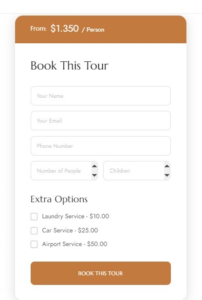
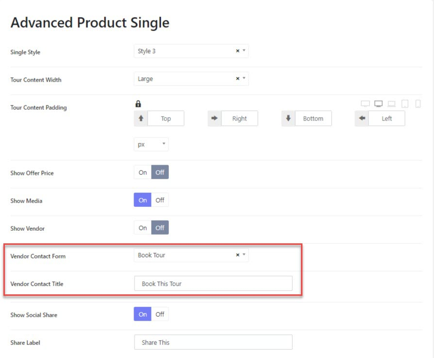

# Tour Inquiry Form

## Edit / Customize the booking form

The tour booking form is created with WPForm, so you can go to WP-admin > WP Form > Edit Book Tour Form. 

> Refer to the WPForm documentation to learn more about the configurations: [https://wpforms.com/docs/](https://wpforms.com/docs/)

## How to assign a form as a booking form

When you create a new booking form and want it to replace the current form, please go to **Travelami Options > Settings > Advanced Products options > Advanced Products Single**

* Vendor Contact Form:  Choose a form (that you created with WPForm).
* Vendor Contact Title: Change the booking form title.

> To change the Book This Tour call-to-action button, you can edit it in the booking form in WPForm. 

