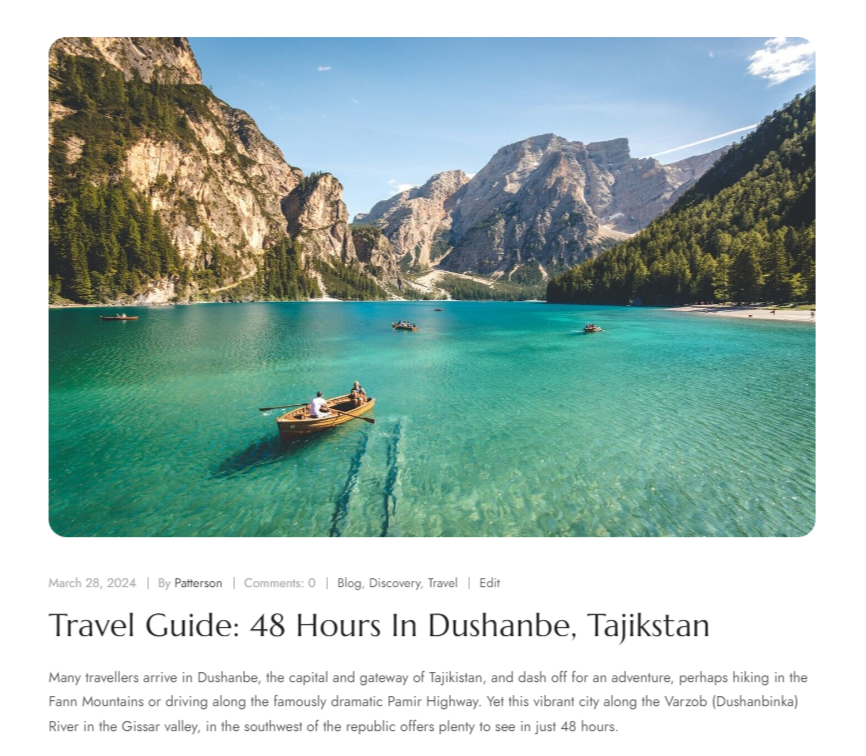
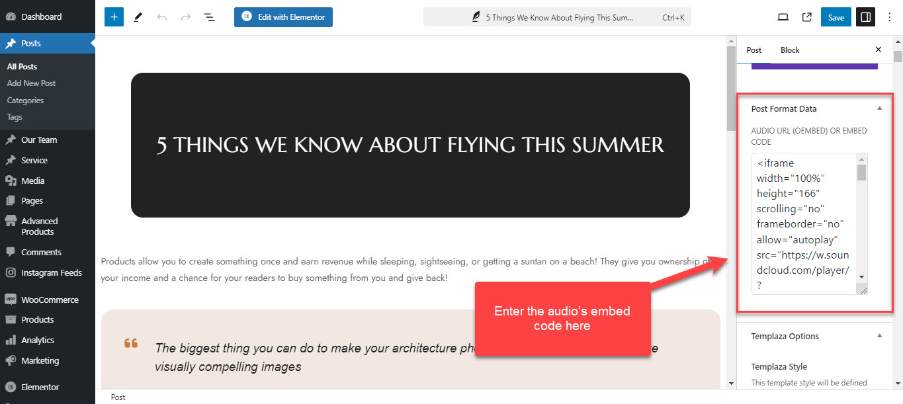
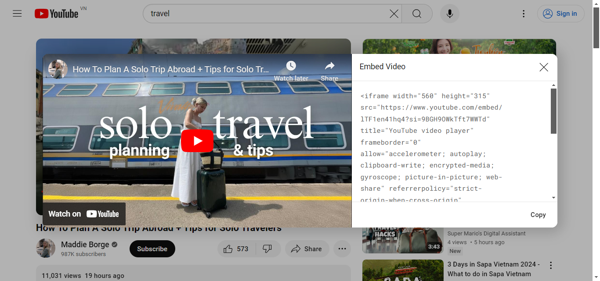
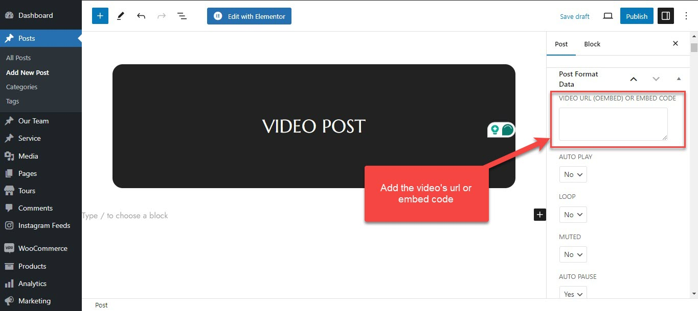

# Blog Default

In this section of the User Guide, we will discuss the creation of blog posts and all the available options for each post, setting up pages to display Blog Listings, Blog Columns, Blog Image Left, Blog Grid, Blog Ajax Load as well as how to change the date format for your posts.

To create a new blog post, go to **Posts > Add New** from your WordPress admin panel. First, you need to enter a title for your blog post in the text field near the top of the screen. Then choose a format for your blog post in **Post Format** in the Summary section on the right side of the screen.

There are 6 main post formats that you can choose from the drop-down list: **Audio, Gallery, Link, Standard, Quote, and Video.**

## Standard post

This is the default single image post format. Enter the post title, content and upload the post's featured image. 

## Audio Post

Create a new blog post, choose the audio format on the right sidebar > and save. Then you can add the audio's embed code to the post format data at the right bottom corner. 

> The theme supports audios from [SoundCloud](https://soundcloud.com/).

## Video Post

After choosing the post format "Video", you can add the URL or embed code of the video from YouTube or Vimeo. 

Open your YouTube or Vimeo videos, click on the Share button,  a popup appears with the embed code, you can copy the code and add it to the post format data of each blog article. 

## Gallery Post

This format features an image gallery slider. After selecting the post format "Gallery", save the post. Then you'll see the Post Format Data at the right bottom corner. There you can choose images from the media library.

