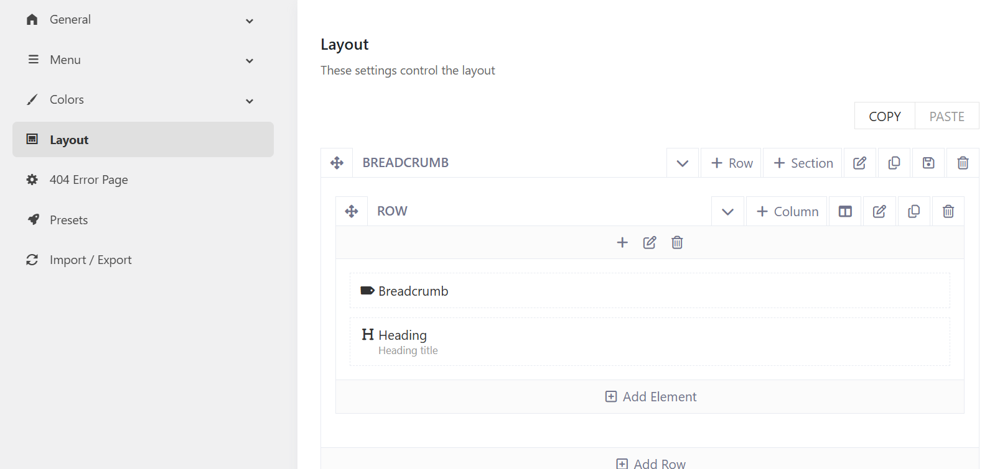

# Remove the breadcrumb heading or breadcrumb path

If you don't want to show the Breadcrumb's heading or the breadcrumb path in the Breadcrumb section, just need to go to Sports Options > Templates > Open a template (ex: Sports About Us)> Layout.
Then remove the corresponding element in the layout. 

