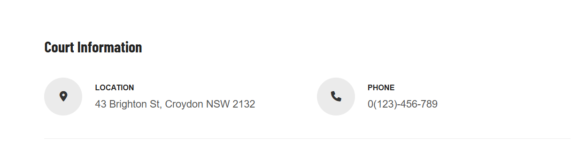

# How to change the tour's custom field order

## How to change the order of custom fields in the detailed tour view

You can find an option to change the order of custom fields in the settings of the Advanced Product plugin. Please go to Advanced Products > Settings > Single Product tab. 

Here you can see Custom field order, choose an appropriate option and save. 

* Most recent first
* Oldest first
* Title alphabetical
* Title reverse alphabetical
* Custom field order
* Custom field reverse order

If you choose the custom field order or Custom field reverse order, you should finish the final step by going to Custom Fields > Reorder the custom fields manually. 

Drag and drop the burger icon on the left of each custom field to a suitable position. 

## How to change the Single Court's tabs

To change these Court tabs, you should go to **Advanced Products > Custom field groups >** Click on the Order to activate the custom order. Then drag & drop the burger icon on the left of each field group to get your wanted order. 

