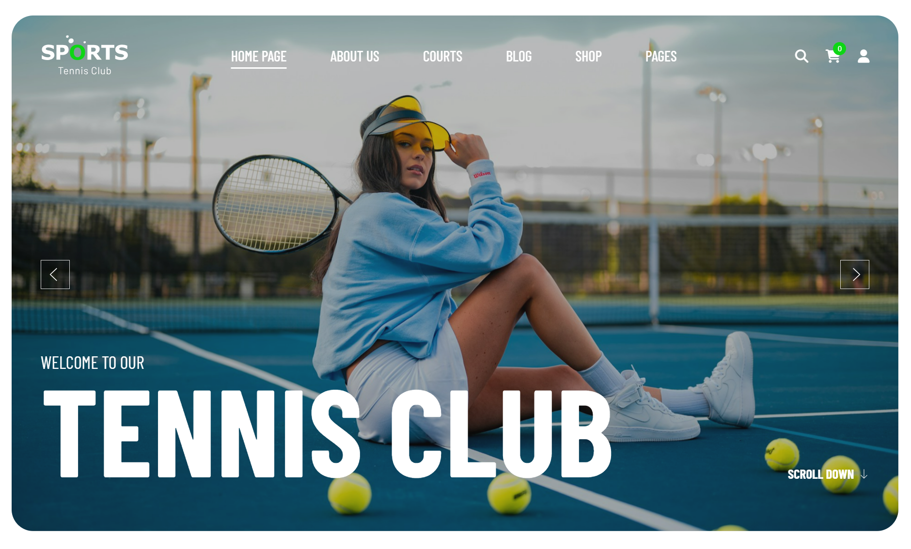

# Sport WordPress Theme Document

**Sport - Sport Clubs & Outdoors WordPress Theme**

Sports is stylish & fresh solution for contemporary tennis club (as well as other sports), personal trainer, sports centers, sports review magazine, tennis clubs, sport school and sports store.
The theme is made with the powerful Elementor, which makes it a perfect solution to build an online presence. It is built WooCommerce ready, to create a powerful store of sports apparel and equipments; The Sports is based on our powerful framework which will help you build a super functional sport related website.
A full-fledged blog, gallery and fully responsive design, Mega Menu, unlimited layout options; the possibilities are endless! Product filtering through advanced search and sorting is available. With the support of the Advanced product plugin, users will find it so easy to use, customize, and manage courts

## Installation & Demo Import

:::tip[Installation & Demo Import]

1. [Theme Installation](../../framework/activation-demo-import/theme-installation.md)
2. [Theme License Activation](../../framework/activation-demo-import/theme-activation.md)
3. [Import Demo Content](../../framework/activation-demo-import/import-demo.md)

:::

## Header Settings

:::tip[Header Settings]

1. [Header](../../framework/header/header.md)
2. [Header Variations](../../framework/header/header-variations.md)
3. [Logo & Favicon](../../framework/header/logo-favicon.md)
4. [Header Icons](../../framework/header/header-icon.md)
5. [Contact Information](../../framework/header/contact-information.md)
6. [Header Presets](../../framework/header/header-presets.md)

:::

## Footer Settings

:::tip

1. [Create a footer](../../framework/footer/creat-footer.md)
2. [Copyright Information](../../framework/footer/copyright.md)
3. [How to copy Footer from one layout to another](../../framework/footer/copy-footer.md)
4. [Footer For Multilingual Site](../../framework/footer/footer-multi.md)

:::

## Fundamental

:::tip[Fundamental]

1. [Smooth Scroll](../../framework/fundamentals/smooth-croll.md)
2. [Back To Top](../../framework/fundamentals/backtotop.md)
3. [Coming Soon](../../framework/fundamentals/coming-soon.md)
4. [Preloader](../../framework/fundamentals/preloader.md)
5. [Cursor Effect](../../framework/fundamentals/cursor-effect.md)
6. [404 Error Page](../../framework/fundamentals/error-page.md)
7. [Custom Code](../../framework/fundamentals/custom-code.md)

:::