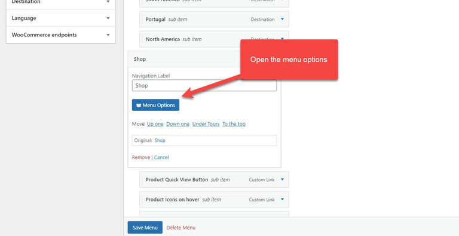
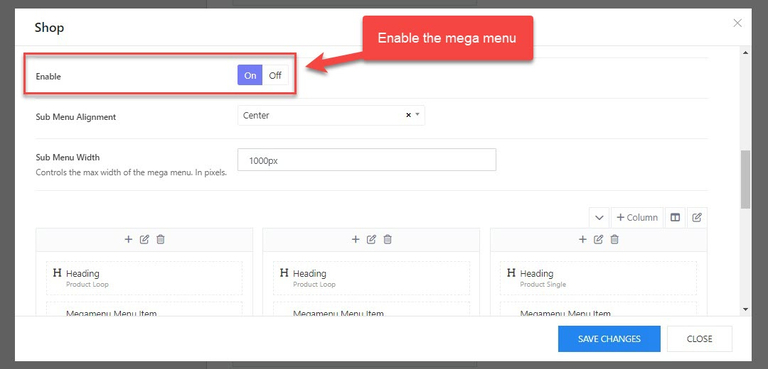
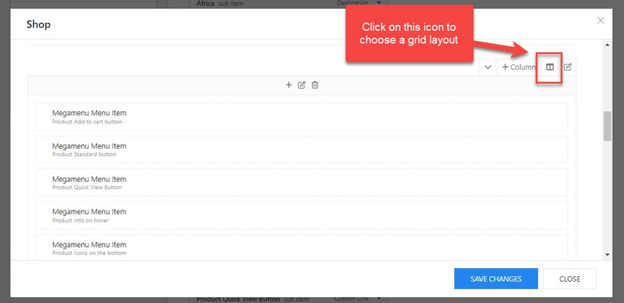
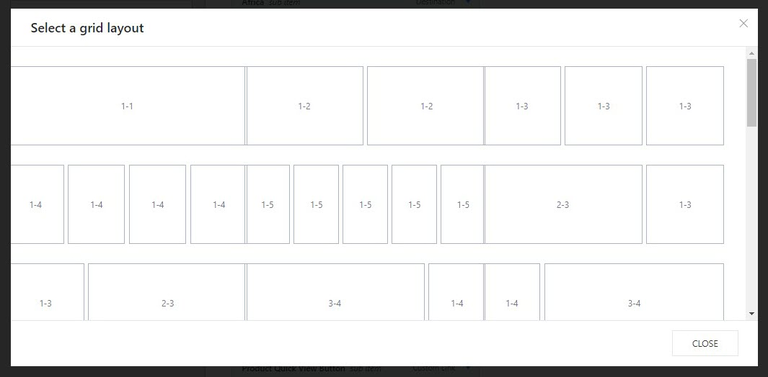
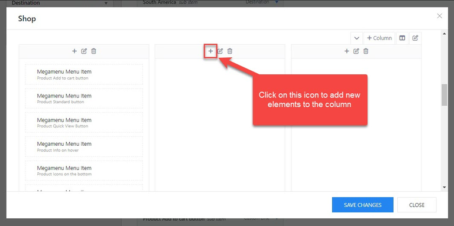
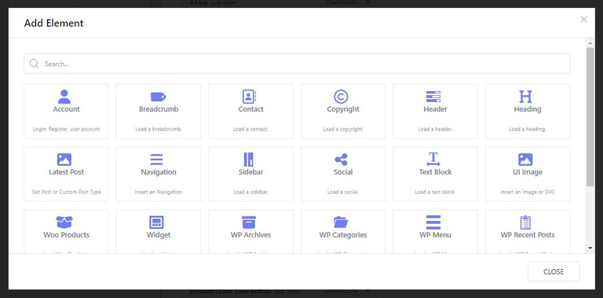
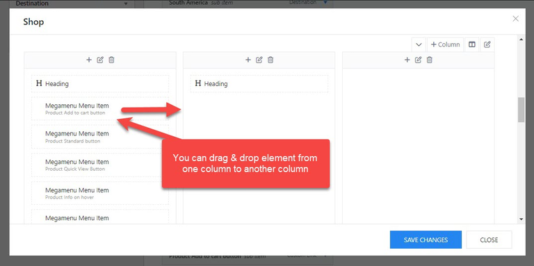
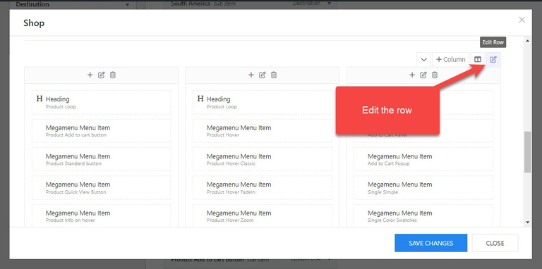
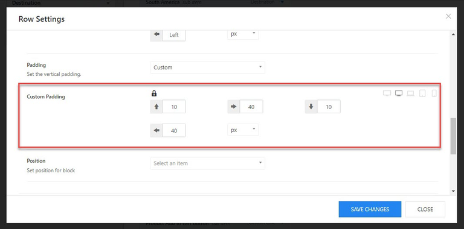

# Mega Menu

## Enable a mega menu

To activate the mega menu, you should go to Appearance > Menus > Open your primary menu > Toggle a menu item > Open the **"Menu Options"**

* **Enable:** Turn on the option to activate the mega menu.
* **Sub-Menu Alignment:** Choose an option for the sub-menu alignment.
* **Sub-Menu Width:** when you choose sub-menu alignment (Left, Right, Center) you will see this option to set the sub-menu width. If you choose Full or Container, this option is not available. 

After enabling the Mega menu, you can see all the sub-menu displays in one column. 

To separate them into different columns, please click on the window icon to open a list of grid layouts, you can choose a prebuilt layout or make a custom layout. 

Then you'll see a popup including all the possible prebuilt grid layouts, you can choose one of the available or create a custom layout. 

Choose a grid layout and start adding new elements by clicking on the "+" icon in each column. You will see a popup including all the available elements to choose from. 

Click on an element you want to add to the column. Then drag & drop elements among columns to fit your need. 

You can drag and drop elements from 1 column to another column and reorder them easily. 

## Adjusting the custom padding of the megamenu

After reordering the elements among columns, you should open the row settings, and adjust the custom padding. 

Click on the edit icon at the right corner > Design Settings > Custom Padding.

