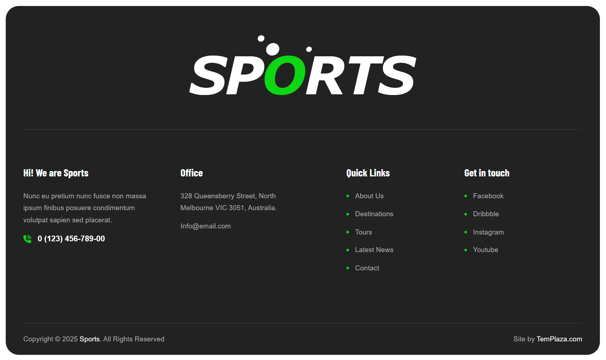
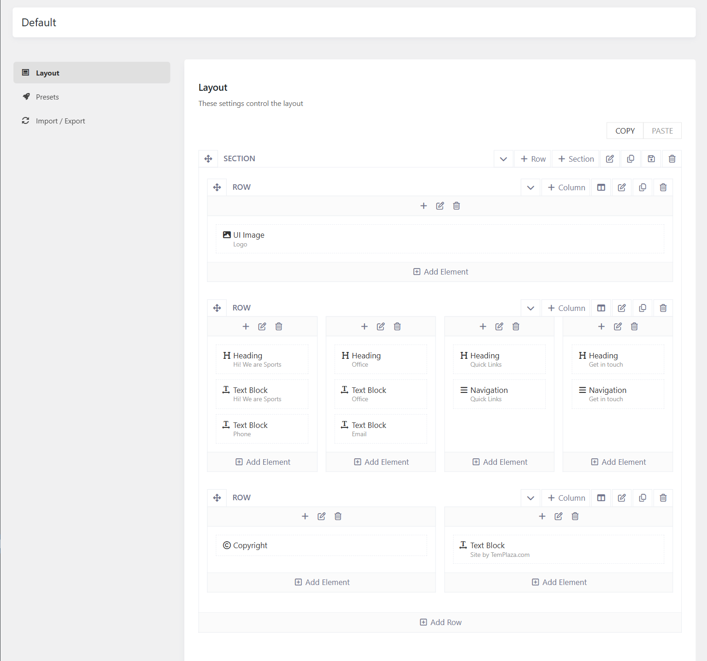
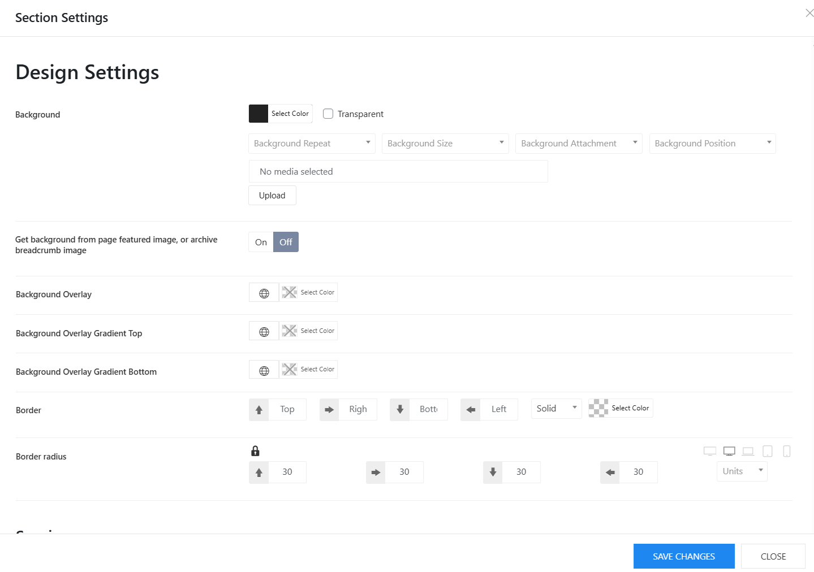

# Theme's Footer

## Footer layout

To change the footer content, please go to Sports Options > Footers > Open your Footer template > Layout.
There you can see the layout built with different elements, you can edit elements such as Heading, Navigation, and Text Block directly in the layout.

* **Social Icons:** If you add Social element to the footer, then please go to Sports Options > Settings > Social > There you can manage social icons.
* **Copyright:** you can go to Sports Options > Settings > Miscellaneous > Copyright.
You can also use a text block to display the copyright.

## Footer Background

To change the black background color of the footer, you can easily edit it from the footer layout.
Please edit the footer section > Design Settings > Change the background color there. 
Beside that, you can also change the background image, background overlay, border radius and so on. 

