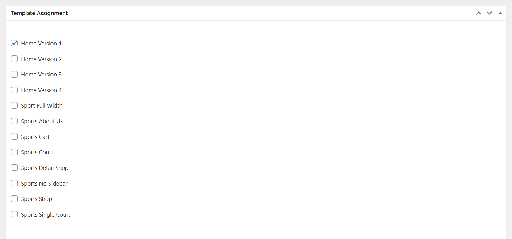

# Header Assignment

Please go to Sport Options > Headers > You can see 5 Prebuilt Headers. 
- Header 1: Assigned to the Home Page 1
- Header 2: Assigned to the Home Page 2
- Header 3: Assigned to the Home Page 3
- Header 4: Assigned to the Home Page 4
- Default: Assigned to the rest of pages

It's possible to have different header styles for different pages. You just need to edit each header > Template Assignment > Assign the header to specific  templates.

In case, you would like to have only one header for the whole website, just remove other redundant headers, or mark one header as default. 

