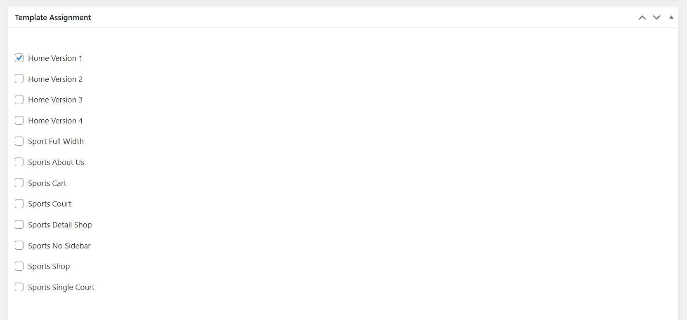

# Header Assignment

Please go to Sport Options > Headers > You can see 6 Prebuilt Headers. 

- Header 1: Assigned to Home version 1
- Header 2: Assigned to Home version 2
- Header 3: Assigned to Home version 3
- Header 4: Assigned to Home version 4
- Header 5: Assigned to Home version 5
- Default: Assigned to the rest of pages

Please edit each header > you will see Template Assignment section. 
Here you can assign the Header to any templates available, so those templates will inherit the header style

It's possible to have different header styles for different pages. You just need to assign headers to specific templates.

In case, you would like to have only one header for the whole website, just remove other redundant headers, or mark one header as default. 

