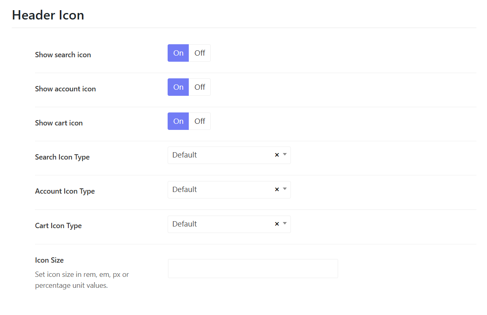

# Header Icons

[sport-header-icons](./img/sport-header-icons.png)

You can see some icons are displaying on the header, such as Search, Cart, and Login icons.

Please go to Sport Options > Headers > Edit each header > Header > Scroll down you'll see the Header Icons Section.
Here you can turn on or off icons. Change their icons among default, font awesome or custom, and configure the icon sizes. 

